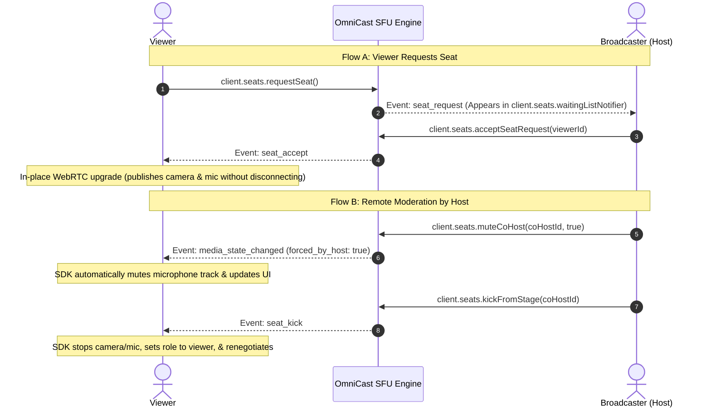

# 🎙️ OmniCast SDK: Co-Host & Stage Moderation Guide

Comprehensive developer guide on implementing **Viewer Co-Host Requests, Waiting List Management, Host Invitations, In-Place WebRTC Renegotiation, and Remote Moderation (Mute / Turn Off Camera / Demote to Viewer / Room Kick)** in the OmniCast Flutter SDK.

---

## 📑 Table of Contents
1. [Architecture & Flow](#1-architecture--flow)
2. [Lifecycle: Viewer Request & Host Acceptance](#2-lifecycle-viewer-request--host-acceptance)
3. [Lifecycle: Host Invites Viewer to Stage](#3-lifecycle-host-invites-viewer-to-stage)
4. [Host & Admin Moderation Controls](#4-host--admin-moderation-controls)
   - [A. Remotely Mute / Unmute a Co-Host](#a-remotely-mute--unmute-a-co-host)
   - [B. Remotely Turn Off a Co-Host's Camera](#b-remotely-turn-off-a-co-hosts-camera)
   - [C. Demote Co-Host Back to Viewer (Remove from Stage)](#c-demote-co-host-back-to-viewer-remove-from-stage)
   - [D. Eject Participant Out of the Room Completely](#d-eject-participant-out-of-the-room-completely)
5. [Waiting List & Reactive Notifiers](#5-waiting-list--reactive-notifiers)
6. [Ready-to-Use Flutter UI Examples](#6-ready-to-use-flutter-ui-examples)
   - [1. Waiting List Sheet (Host Screen)](#1-waiting-list-sheet-host-screen)
   - [2. Co-Host Stage Management Bottom Sheet](#2-co-host-stage-management-bottom-sheet)
   - [3. Incoming Invitation Dialog (Viewer Screen)](#3-incoming-invitation-dialog-viewer-screen)

---

## 1. Architecture & Flow



---

## 2. Lifecycle: Viewer Request & Host Acceptance

### Step 1: Viewer sends seat request
```dart
// Viewer requests to take an open stage seat (e.g. seat #1)
client.seats.requestSeat(seatIndex: 1);

// Viewer can cancel if waiting too long
client.seats.cancelSeatRequest();
```

### Step 2: Host accepts or rejects from waiting list
```dart
// Accept request
client.seats.acceptSeatRequest(requesterUserId, seatIndex: 1);

// Reject request
client.seats.rejectSeatRequest(requesterUserId);
```

---

## 3. Lifecycle: Host Invites Viewer to Stage

### Step 1: Host invites viewer
```dart
client.seats.inviteToCoHost(targetViewerId, seatIndex: 2);
```

### Step 2: Viewer receives and accepts invitation
```dart
// In Viewer's initState
client.seats.onSeatInviteReceived.listen((invite) {
  showDialog(
    context: context,
    builder: (ctx) => AlertDialog(
      title: const Text('Co-Host Invitation'),
      content: const Text('The host has invited you to join the stage!'),
      actions: [
        TextButton(
          onPressed: () {
            client.seats.rejectCoHostInvite(inviteId: invite.inviteId);
            Navigator.pop(ctx);
          },
          child: const Text('Decline'),
        ),
        ElevatedButton(
          onPressed: () {
            // Accepts and automatically turns on camera & microphone
            client.seats.acceptCoHostInvite(
              inviteId: invite.inviteId,
              video: true,
              audio: true,
            );
            Navigator.pop(ctx);
          },
          child: const Text('Join Stage 🎙️'),
        ),
      ],
    ),
  );
});
```

---

## 4. Host & Admin Moderation Controls

### A. Remotely Mute / Unmute a Co-Host
```dart
// Mute co-host microphone remotely
client.seats.muteCoHost('cohost_user_123', mute: true);

// Unmute co-host microphone remotely
client.seats.muteCoHost('cohost_user_123', mute: false);
```

### B. Remotely Turn Off a Co-Host's Camera
```dart
client.seats.disableCoHostCamera('cohost_user_123');
```

### C. Demote Co-Host Back to Viewer (Remove from Stage)
Demotes the co-host back to a viewer without kicking them out of the live room:
```dart
client.seats.kickFromStage('cohost_user_123');
// or
client.seats.demoteToViewer('cohost_user_123');
```

### D. Eject Participant Out of the Room Completely
Forcefully disconnects and kicks the participant out of the entire broadcast:
```dart
client.kickUser('cohost_user_123', reason: 'Repeated guideline violations');
```

---

## 5. Waiting List & Reactive Notifiers

| Notifier | Type | Description |
| :--- | :--- | :--- |
| `client.seats.waitingListNotifier` | `ValueNotifier<List<SeatRequest>>` | List of viewers waiting for approval to join stage. |
| `client.seats.activeCoHostsList` | `ValueNotifier<List<StageSeat>>` | List of currently active stage seats and occupied users. |
| `client.seats.pendingInvitesNotifier` | `ValueNotifier<List<CoHostInvite>>` | Pending invitations sent by host. |

---

## 6. Ready-to-Use Flutter UI Examples

### 1. Waiting List Sheet (Host Screen)

```dart
void showWaitingListModal(BuildContext context, OmniCastClient client) {
  showModalBottomSheet(
    context: context,
    backgroundColor: const Color(0xFF0F172A),
    shape: const RoundedRectangleBorder(
      borderRadius: BorderRadius.vertical(top: Radius.circular(24)),
    ),
    builder: (ctx) {
      return ValueListenableBuilder<List<SeatRequest>>(
        valueListenable: client.seats.waitingListNotifier,
        builder: (context, requests, _) {
          return Padding(
            padding: const EdgeInsets.all(16.0),
            child: Column(
              mainAxisSize: MainAxisSize.min,
              children: [
                Text(
                  'Co-Host Requests (${requests.length})',
                  style: const TextStyle(color: Colors.white, fontSize: 18, fontWeight: FontWeight.bold),
                ),
                const SizedBox(height: 12),
                Expanded(
                  child: requests.isEmpty
                      ? const Center(child: Text('No pending requests', style: TextStyle(color: Colors.white38)))
                      : ListView.builder(
                          itemCount: requests.length,
                          itemBuilder: (context, index) {
                            final req = requests[index];
                            return ListTile(
                              leading: CircleAvatar(
                                backgroundImage: NetworkImage(req.requesterAvatar ?? ''),
                              ),
                              title: Text(req.requesterName ?? req.requesterId, style: const TextStyle(color: Colors.white)),
                              trailing: Row(
                                mainAxisSize: MainAxisSize.min,
                                children: [
                                  IconButton(
                                    icon: const Icon(Icons.check_circle, color: Colors.greenAccent),
                                    onPressed: () => client.seats.acceptSeatRequest(req.requesterId),
                                  ),
                                  IconButton(
                                    icon: const Icon(Icons.cancel, color: Colors.redAccent),
                                    onPressed: () => client.seats.rejectSeatRequest(req.requesterId),
                                  ),
                                ],
                              ),
                            );
                          },
                        ),
                ),
              ],
            ),
          );
        },
      );
    },
  );
}
```

---

### 2. Co-Host Stage Management Bottom Sheet (Moderation Controls)

When the host taps on a co-host's video tile or avatar:

```dart
void showCoHostModerationSheet(BuildContext context, OmniCastClient client, StageSeat seat) {
  final coHostId = seat.userId!;

  showModalBottomSheet(
    context: context,
    backgroundColor: const Color(0xFF1E293B),
    shape: const RoundedRectangleBorder(borderRadius: BorderRadius.vertical(top: Radius.circular(20))),
    builder: (ctx) {
      return Column(
        mainAxisSize: MainAxisSize.min,
        children: [
          ListTile(
            leading: CircleAvatar(backgroundImage: NetworkImage(seat.userAvatar ?? '')),
            title: Text(seat.userName ?? coHostId, style: const TextStyle(color: Colors.white)),
            subtitle: Text('Seat #${seat.seatIndex + 1}', style: const TextStyle(color: Colors.white54)),
          ),
          const Divider(color: Colors.white12),

          // 1. Mute / Unmute Microphone
          ListTile(
            leading: Icon(seat.isMuted ? Icons.mic : Icons.mic_off, color: Colors.orangeAccent),
            title: Text(seat.isMuted ? 'Unmute Microphone' : 'Mute Microphone', style: const TextStyle(color: Colors.white)),
            onTap: () {
              client.seats.muteCoHost(coHostId, mute: !seat.isMuted);
              Navigator.pop(ctx);
            },
          ),

          // 2. Turn off camera
          ListTile(
            leading: const Icon(Icons.videocam_off, color: Colors.amberAccent),
            title: const Text('Turn Off Camera', style: TextStyle(color: Colors.white)),
            onTap: () {
              client.seats.disableCoHostCamera(coHostId);
              Navigator.pop(ctx);
            },
          ),

          // 3. Remove from Stage (Demote to Viewer)
          ListTile(
            leading: const Icon(Icons.person_remove, color: Colors.deepOrangeAccent),
            title: const Text('Remove from Stage', style: TextStyle(color: Colors.white)),
            onTap: () {
              client.seats.kickFromStage(coHostId);
              Navigator.pop(ctx);
            },
          ),

          // 4. Kick from Room completely
          ListTile(
            leading: const Icon(Icons.gavel, color: Colors.redAccent),
            title: const Text('Kick from Room', style: TextStyle(color: Colors.redAccent)),
            onTap: () {
              client.kickUser(coHostId, reason: 'Removed by host moderation');
              Navigator.pop(ctx);
            },
          ),
        ],
      );
    },
  );
}
```
