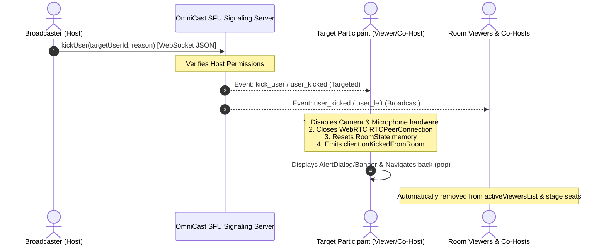

# 👢 OmniCast SDK: Participant Kick & Ejection Guide

Comprehensive guide and architectural specification for the **Participant Kick & Forceful Ejection** system in the OmniCast Flutter SDK.

---

## 📑 Table of Contents
1. [Architecture Overview](#1-architecture-overview)
2. [Signaling JSON Protocol Contract](#2-signaling-json-protocol-contract)
3. [SDK API Reference](#3-sdk-api-reference)
4. [Data Models](#4-data-models)
5. [Flutter UI Integration Guide](#5-flutter-ui-integration-guide)
   - [Target User Ejection Handling](#a-target-user-handling-viewerco-host)
   - [Host Kick Action Handling](#b-host-kick-action-ui)
6. [Under-The-Hood Lifecycle & Cleanup](#6-under-the-hood-lifecycle--cleanup)

---

## 1. Architecture Overview



---

## 2. Signaling JSON Protocol Contract

When a host ejects a participant, the client transmits a standardized JSON envelope over the WebSocket signaling channel:

```json
{
  "event": "kick_user",
  "room_id": "room_101",
  "user_id": "host_alice",
  "target_user": "user_bad_guy",
  "payload": {
    "room_id": "room_101",
    "target_user": "user_bad_guy",
    "user_id": "user_bad_guy",
    "reason": "Violated community guidelines",
    "kicked_by": "host_alice"
  }
}
```

### Supported Inbound Event Aliases:
The SDK automatically recognizes and processes the following event names from the SFU:
- `kick_user`
- `user_kicked`
- `kicked`
- `user_ejected`

---

## 3. SDK API Reference

### A. Action Methods (`OmniCastClient` & `RoomManager`)

#### `client.kickUser(String targetUserId, {String? reason})`
Sends a kick command to the signaling server.
- **Parameters:**
  - `targetUserId` (`String`, required): The unique identifier of the user to be ejected.
  - `reason` (`String?`, optional): Reason message displayed to the ejected user.
- **Permission:** Host only.

#### `client.kickParticipant(String targetUserId, {String? reason})`
Convenience alias for `client.kickUser()`.

---

### B. Event Streams

#### `client.onKickedFromRoom`
- **Type:** `Stream<KickedEvent>`
- **Description:** Emits only on the specific device/client of the user who was kicked.
- **Usage:** Listen on the viewer screen to display an ejection alert and navigate back to the home screen.

#### `client.onUserKicked`
- **Type:** `Stream<String>`
- **Description:** Emits the `userId` of any user kicked from the room to all participants.
- **Usage:** Useful for showing a live notification/toast in the chat stream (e.g. *"User123 was kicked by the host"*).

---

## 4. Data Models

### `KickedEvent`
```dart
class KickedEvent {
  final String roomId;        // ID of the room from which user was ejected
  final String userId;        // ID of the ejected user
  final String? reason;       // Optional reason provided by host
  final String? kickedBy;     // Host ID who initiated the kick
  final DateTime timestamp;   // Exact time of ejection
}
```

---

## 5. Flutter UI Integration Guide

### A. Target User Handling (Viewer/Co-Host)

When a participant is ejected, their media hardware and WebRTC connection are torn down automatically. The application layer only needs to present the feedback dialog and close the screen:

```dart
// lib/screens/live_room_screen.dart (Viewer side)
@override
void initState() {
  super.initState();

  // 1. Listen for forceful ejection by the host
  _client.onKickedFromRoom.listen((event) {
    if (!mounted) return;

    showDialog(
      context: context,
      barrierDismissible: false,
      builder: (ctx) => AlertDialog(
        shape: RoundedRectangleBorder(borderRadius: BorderRadius.circular(16)),
        backgroundColor: const Color(0xFF1E293B),
        title: const Row(
          children: [
            Icon(Icons.gavel_rounded, color: Colors.redAccent, size: 24),
            SizedBox(width: 8),
            Text(
              'Removed from Room',
              style: TextStyle(color: Colors.white, fontWeight: FontWeight.bold),
            ),
          ],
        ),
        content: Text(
          event.reason ?? 'You have been removed from this live stream by the host.',
          style: const TextStyle(color: Colors.white70, fontSize: 14),
        ),
        actions: [
          ElevatedButton(
            style: ElevatedButton.styleFrom(
              backgroundColor: Colors.redAccent,
              shape: RoundedRectangleBorder(borderRadius: BorderRadius.circular(8)),
            ),
            onPressed: () {
              Navigator.of(ctx).pop(); // Dismiss dialog
              Navigator.of(context).pop(); // Exit Live Screen
            },
            child: const Text('OK', style: TextStyle(color: Colors.white)),
          ),
        ],
      ),
    );
  });
}
```

---

### B. Host Kick Action UI

Provide a kick button in the active viewers bottom sheet or participant profile modal:

```dart
// lib/widgets/viewer_profile_bottom_sheet.dart (Host side)
Widget _buildKickButton(BuildContext context, Participant viewer) {
  return ElevatedButton.icon(
    icon: const Icon(Icons.person_remove_rounded, color: Colors.white),
    label: const Text('Kick User'),
    style: ElevatedButton.styleFrom(
      backgroundColor: Colors.redAccent,
      padding: const EdgeInsets.symmetric(horizontal: 16, vertical: 12),
      shape: RoundedRectangleBorder(borderRadius: BorderRadius.circular(10)),
    ),
    onPressed: () {
      // 1. Execute Kick
      client.kickUser(
        viewer.userId,
        reason: 'Inappropriate behavior or language in live chat',
      );

      // 2. Dismiss modal
      Navigator.of(context).pop();

      // 3. Feedback toast
      ScaffoldMessenger.of(context).showSnackBar(
        SnackBar(
          content: Text('${viewer.displayName ?? viewer.userId} was kicked.'),
          backgroundColor: Colors.black87,
        ),
      );
    },
  );
}
```

---

## 6. Under-The-Hood Lifecycle & Cleanup

When a participant is kicked, the SDK guarantees zero resource leaks through the following sequence:

1. **Hardware Media Teardown:** Immediately calls `mediaStreamManager.stopLocalMedia()` to release camera and microphone hardware tracks.
2. **WebRTC Disconnection:** Calls `webRTCManager.closePeerConnection()` to terminate the `RTCPeerConnection` and avoid orphan UDP traffic.
3. **RoomState Reset:** Resets all reactive variables, chat history, active seats, and connection states.
4. **Room Viewers Cache Sync:** Ejected users are automatically removed from `RoomManager.activeViewersList` and `RoomState.activeSeats` across all connected peers.
