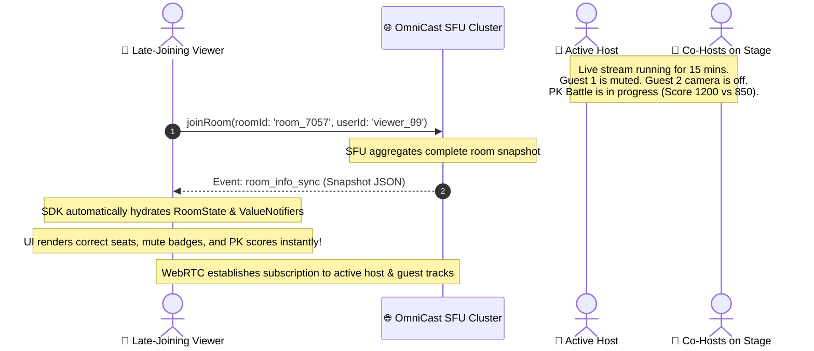

# 🔄 OmniCast SDK: Late-Join State Synchronization Guide

Comprehensive guide on how **Late-Joining Users** (viewers entering a live broadcast after it has already started) automatically receive and hydrate complete room states — including **Seat Occupancy, Microphone Mute/Unmute States, Camera On/Off States, PK Battle Scores & Timers, and Viewers Lists**.

---

## 📑 Table of Contents
1. [Architecture & How Late-Join Sync Works](#1-architecture--how-late-join-sync-works)
2. [The Authoritative Snapshot: `room_info_sync`](#2-the-authoritative-snapshot-room_info_sync)
3. [What Gets Synchronized Automatically](#3-what-gets-synchronized-automatically)
4. [Reactive Flutter State Access Points](#4-reactive-flutter-state-access-points)
5. [Pre-Built Widgets with Automatic Late-Join Support](#5-pre-built-widgets-with-automatic-late-join-support)
6. [Building Custom UI for Late-Join Scenarios](#6-building-custom-ui-for-late-join-scenarios)
   - [A. Real-Time 8-Seat Audio/Video Grid with Mute Badges](#a-real-time-8-seat-audiovideo-grid-with-mute-badges)
   - [B. Ongoing PK Battle & Score Bar Sync](#b-ongoing-pk-battle--score-bar-sync)
7. [Best Practices & Performance Tuning](#7-best-practices--performance-tuning)

---

## 1. Architecture & How Late-Join Sync Works

When a user joins a room 10 minutes into a live stream, they need the current room status immediately without waiting for incremental events.



---

## 2. The Authoritative Snapshot: `room_info_sync`

Upon completing the WebSocket handshake, the SFU server immediately sends the `room_info_sync` payload to the new subscriber:

```json
{
  "event": "room_info_sync",
  "room_id": "room_7057",
  "host_id": "host_alex",
  "room_type": "video",
  "room_mode": "co_host",
  "viewers_count": 1420,
  "host_coin_balance": 52000,
  "pinned_user_id": null,
  "active_seats": [
    {
      "seat_index": 0,
      "user_id": "host_alex",
      "user_name": "Alex Broadcaster",
      "avatar_url": "https://api.dicebear.com/7.x/bottts/png?seed=host_alex",
      "is_muted": false,
      "is_camera_off": false,
      "role": "host"
    },
    {
      "seat_index": 1,
      "user_id": "guest_rahim",
      "user_name": "Rahim (Guest)",
      "avatar_url": "https://api.dicebear.com/7.x/bottts/png?seed=guest_rahim",
      "is_muted": true,
      "is_camera_off": false,
      "role": "coHost"
    },
    {
      "seat_index": 2,
      "user_id": "guest_karim",
      "user_name": "Karim (Singer)",
      "avatar_url": "https://api.dicebear.com/7.x/bottts/png?seed=guest_karim",
      "is_muted": false,
      "is_camera_off": true,
      "role": "coHost"
    }
  ],
  "media_states": {
    "host_alex": { "is_muted": false, "is_camera_off": false },
    "guest_rahim": { "is_muted": true, "is_camera_off": false },
    "guest_karim": { "is_muted": false, "is_camera_off": true }
  },
  "pk_battle": {
    "battle_id": "pk_9921",
    "host_user_id": "host_alex",
    "opponent_user_id": "host_sarah",
    "opponent_room_id": "room_sarah_102",
    "status": "in_progress",
    "host_score": 1250,
    "opponent_score": 890,
    "duration_seconds": 300,
    "started_at": "2026-09-03T16:20:00Z"
  }
}
```

---

## 3. What Gets Synchronized Automatically

| Feature | Late-Join State Restored |
| :--- | :--- |
| **🪑 Seat Assignments** | Who is sitting on Seat 0, 1, 2... 8 with avatars and roles. |
| **🔇 Mic Mute States** | Which co-hosts are muted (`is_muted: true`). |
| **📷 Camera States** | Which co-hosts have their camera turned off (`is_camera_off: true`). |
| **⚔️ PK Battle & Scores** | Active opponent ID, live scores (e.g. 1250 vs 890), remaining timer. |
| **👥 Viewers Count** | Total concurrent viewer count and top viewer avatar objects. |
| **📌 Pinned Speaker** | The currently spotlighted speaker on the stage. |

---

## 4. Reactive Flutter State Access Points

Developers can read and bind UI widgets using these reactive getters on `client`:

| Access Point | Type | Description |
| :--- | :--- | :--- |
| `client.activeSeatsNotifier` | `ValueNotifier<List<StageSeat>>` | List of all stage seats (0-7). Updates instantly on sync. |
| `client.state.isUserAudioMuted(userId)` | `bool` | Returns `true` if the specified user is muted. |
| `client.state.isUserCameraOff(userId)` | `bool` | Returns `true` if the user's camera is disabled. |
| `client.state.roomModeNotifier` | `ValueNotifier<RoomMode>` | Returns `RoomMode.solo`, `RoomMode.coHost`, or `RoomMode.pk`. |
| `client.state.pkScoreNotifier` | `ValueNotifier<PkScore>` | Real-time PK scores of host and opponent. |
| `client.totalViewerCount` | `ValueNotifier<int>` | Total online viewers count. |

---

## 5. Pre-Built Widgets with Automatic Late-Join Support

The pre-built widgets in `omnicast_client` have full late-join synchronization built-in:

### 1. `OmniCastVideoCanvas`
Automatically detects whether the room is in **Solo**, **Multi-guest Co-Host**, or **PK Battle** mode and renders the correct split-screen or multi-guest layout without any manual configuration:
```dart
OmniCastVideoCanvas(
  client: _client,
  hostName: 'Alex Host',
)
```

### 2. `OmniCastSpeakingVideoTile`
Renders video when camera is on, profile avatar when camera is off, mic-muted badge 🔇 when muted, and animated glowing green aura when speaking:
```dart
OmniCastSpeakingVideoTile(
  userId: seat.userId!,
  trackId: seat.userId!,
  userName: seat.userName ?? 'Guest',
  avatarUrl: seat.avatarUrl,
  renderer: client.streamManager.getRenderer(seat.userId!),
  isCameraEnabled: !client.state.isUserCameraOff(seat.userId!),
  isMicMuted: client.state.isUserAudioMuted(seat.userId!),
  audioDetector: client.media.audioDetector,
)
```

---

## 6. Building Custom UI for Late-Join Scenarios

### A. Real-Time 8-Seat Audio/Video Grid with Mute Badges

```dart
Widget buildCoHostSeatGrid(BuildContext context, OmniCastClient client) {
  return ValueListenableBuilder<List<StageSeat>>(
    valueListenable: client.activeSeatsNotifier,
    builder: (context, seats, _) {
      if (seats.isEmpty) return const SizedBox.shrink();

      return GridView.builder(
        shrinkWrap: true,
        physics: const NeverScrollableScrollPhysics(),
        gridDelegate: const SliverGridDelegateWithFixedCrossAxisCount(
          crossAxisCount: 4,
          childAspectRatio: 0.8,
          crossAxisSpacing: 8,
          mainAxisSpacing: 8,
        ),
        itemCount: 8, // 8 stage seats
        itemBuilder: (context, index) {
          final seat = seats.firstWhere(
            (s) => s.index == index,
            orElse: () => StageSeat(index: index),
          );

          final isOccupied = seat.userId != null && seat.userId!.isNotEmpty;
          final isMuted = isOccupied && client.state.isUserAudioMuted(seat.userId!);
          final isCameraOff = isOccupied && client.state.isUserCameraOff(seat.userId!);

          return Container(
            decoration: BoxDecoration(
              color: const Color(0xFF1E293B),
              borderRadius: BorderRadius.circular(12),
              border: Border.all(color: Colors.white12),
            ),
            child: Stack(
              alignment: Alignment.center,
              children: [
                if (!isOccupied)
                  const Column(
                    mainAxisAlignment: MainAxisAlignment.center,
                    children: [
                      Icon(Icons.chair_outlined, color: Colors.white30, size: 28),
                      SizedBox(height: 4),
                      Text('Empty', style: TextStyle(color: Colors.white38, fontSize: 10)),
                    ],
                  )
                else ...[
                  // 1. User Avatar / Video
                  CircleAvatar(
                    radius: 24,
                    backgroundImage: NetworkImage(
                      seat.avatarUrl ?? 'https://api.dicebear.com/7.x/bottts/png?seed=${seat.userId}',
                    ),
                  ),

                  // 2. Camera Off Overlay
                  if (isCameraOff)
                    Positioned(
                      top: 6,
                      left: 6,
                      child: Container(
                        padding: const EdgeInsets.all(3),
                        decoration: const BoxDecoration(color: Colors.black54, shape: BoxShape.circle),
                        child: const Icon(Icons.videocam_off, color: Colors.white70, size: 12),
                      ),
                    ),

                  // 3. Mic Muted Badge (Late-join synced!)
                  if (isMuted)
                    Positioned(
                      top: 6,
                      right: 6,
                      child: Container(
                        padding: const EdgeInsets.all(3),
                        decoration: const BoxDecoration(color: Colors.redAccent, shape: BoxShape.circle),
                        child: const Icon(Icons.mic_off, color: Colors.white, size: 12),
                      ),
                    ),

                  // 4. User Name
                  Positioned(
                    bottom: 6,
                    child: Text(
                      seat.userName ?? 'User',
                      style: const TextStyle(color: Colors.white, fontSize: 11, fontWeight: FontWeight.w600),
                      overflow: TextOverflow.ellipsis,
                    ),
                  ),
                ],
              ],
            ),
          );
        },
      );
    },
  );
}
```

---

### B. Ongoing PK Battle & Score Bar Sync

If a late-joining user enters during an active PK battle:

```dart
Widget buildLateJoinPKScoreBar(BuildContext context, OmniCastClient client) {
  return ValueListenableBuilder<RoomMode>(
    valueListenable: client.state.roomModeNotifier,
    builder: (context, mode, _) {
      if (mode != RoomMode.pk) return const SizedBox.shrink();

      return ValueListenableBuilder<PkScore>(
        valueListenable: client.state.pkScoreNotifier,
        builder: (context, score, _) {
          return PKScoreProgressBar(
            hostScore: score.hostScore,
            opponentScore: score.opponentScore,
            hostName: 'Host',
            opponentName: client.state.activePK?.opponentUserId ?? 'Opponent',
          );
        },
      );
    },
  );
}
```

---

## 7. Best Practices & Performance Tuning

1. **Zero-Lag First Frame**: When `room_info_sync` arrives, WebRTC transceivers are configured with `recvonly` for all remote stage tracks.
2. **Atomic State Updates**: State hydration occurs synchronously in memory before notifying listeners, preventing any flickering or layout jumps.
3. **Automatic Track Recovery**: If a guest turns their mic back on after the late-join user arrives, the incremental `media_state_changed` event automatically updates the same state map in real time.
