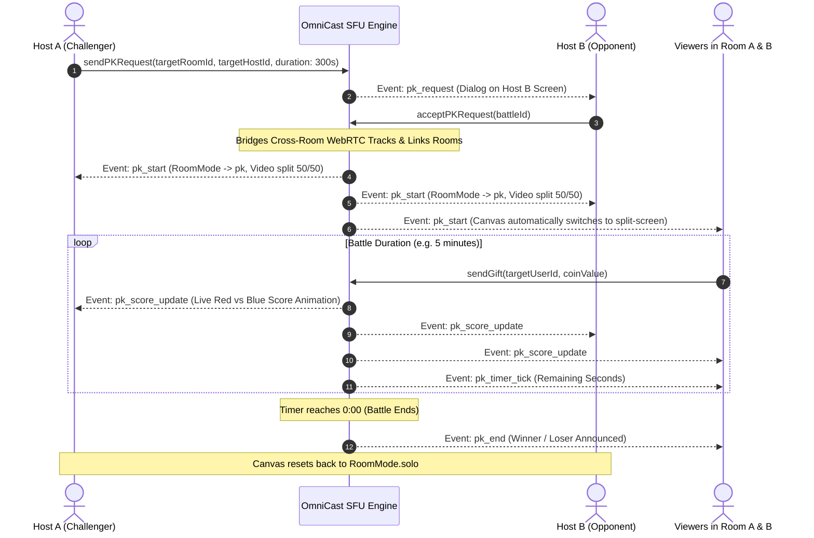

# ⚔️ OmniCast SDK: PK Battle Integration Guide

Complete end-to-end integration manual and architecture reference for the **Host vs Host Cross-Room PK Battle System** in the OmniCast Flutter SDK.

---

## 📑 Table of Contents
1. [PK Battle Architecture & Flow](#1-pk-battle-architecture--flow)
2. [Signaling JSON Contracts](#2-signaling-json-contracts)
3. [SDK API Reference (`client.pk`)](#3-sdk-api-reference-clientpk)
4. [Data Models & States](#4-data-models--states)
5. [Step-by-Step Flutter UI Integration](#5-step-by-step-flutter-ui-integration)
   - [Step 1: Host A Sends PK Challenge](#step-1-host-a-sends-pk-challenge)
   - [Step 2: Host B Receives & Accepts PK Challenge](#step-2-host-b-receives--accepts-pk-challenge)
   - [Step 3: Rendering the Split-Screen PK Canvas](#step-3-rendering-the-split-screen-pk-canvas)
   - [Step 4: Cross-Room Targeted Gifting & Live Score Engine](#step-4-cross-room-targeted-gifting--live-score-engine)
   - [Step 5: Timer Countdown & Ending PK](#step-5-timer-countdown--ending-pk)
6. [Best Practices & Troubleshooting](#6-best-practices--troubleshooting)

---

## 1. PK Battle Architecture & Flow



---

## 2. Signaling JSON Contracts

### A. Send PK Challenge (`pk_request`)
```json
{
  "event": "pk_request",
  "room_id": "room_101",
  "user_id": "host_alice",
  "target_user": "host_bob",
  "payload": {
    "target_room_id": "room_202",
    "target_host_id": "host_bob",
    "duration_seconds": 300
  }
}
```

### B. Accept PK Challenge (`pk_accept`)
```json
{
  "event": "pk_accept",
  "room_id": "room_202",
  "user_id": "host_bob",
  "payload": {
    "battle_id": "pk_987654",
    "opponent_room_id": "room_101",
    "opponent_host_id": "host_alice"
  }
}
```

### C. PK Start Broadcast (`pk_start` / `pk_started`)
```json
{
  "event": "pk_start",
  "room_id": "room_101",
  "user_id": "server",
  "payload": {
    "battle_id": "pk_987654",
    "host_room_id": "room_101",
    "host_user_id": "host_alice",
    "opponent_room_id": "room_202",
    "opponent_user_id": "host_bob",
    "opponent_display_name": "Bob Streamer",
    "opponent_avatar_url": "https://example.com/avatar_bob.png",
    "duration_seconds": 300,
    "remaining_seconds": 300,
    "host_score": 0,
    "opponent_score": 0,
    "status": "in_progress"
  }
}
```

### D. Real-Time Score Update (`pk_score_update`)
```json
{
  "event": "pk_score_update",
  "room_id": "room_101",
  "user_id": "server",
  "payload": {
    "battle_id": "pk_987654",
    "host_score": 1500,
    "opponent_score": 980
  }
}
```

---

## 3. SDK API Reference (`client.pk`)

| Method / Getter | Return Type | Description |
| :--- | :--- | :--- |
| `client.pk.sendPKRequest(...)` | `void` | Sends a cross-room PK challenge to another host. |
| `client.pk.acceptPKRequest(...)` | `void` | Accepts an incoming PK battle challenge. |
| `client.pk.rejectPKRequest(...)` | `void` | Declines an incoming PK challenge. |
| `client.pk.endPK(...)` | `void` | Forcibly terminates an ongoing PK battle. |
| `client.pk.isPKActive` | `bool` | Whether a PK battle is currently in progress. |
| `client.pk.pkStateNotifier` | `ValueNotifier<PKState>` | Granular state notifier (idle, requested, inProgress, punishment). |
| `client.pk.timerNotifier` | `ValueNotifier<int>` | Countdown remaining seconds notifier (300 -> 0). |
| `client.pk.onPKStarted` | `Stream<PKBattleInfo>` | Stream emitting when battle starts. |
| `client.pk.onPKScoreUpdated` | `Stream<PKScoreUpdate>` | Stream emitting real-time scores for host & opponent. |
| `client.pk.onPKTimerTick` | `Stream<PKTimerTick>` | Stream emitting second-by-second countdown. |
| `client.pk.onPKEnded` | `Stream<String>` | Stream emitting battleId when PK finishes. |

---

## 4. Data Models & States

### `PKState` Enum
```dart
enum PKStatus {
  idle,         // No battle active
  invited,      // Incoming challenge pending
  inProgress,   // Live 50/50 battle active
  punishment,   // Punishment phase for the loser
  ended,        // Battle finished
}
```

### `PkScore`
```dart
class PkScore {
  final int hostScore;      // Blue team score
  final int opponentScore;  // Red team score

  double get hostRatio;     // Normalized ratio for progress bar (0.05 to 0.95)
  double get opponentRatio;
}
```

---

## 5. Step-by-Step Flutter UI Integration

### Step 1: Host A Sends PK Challenge

Fetch the list of active live rooms using `client.api.getLiveRooms()` and challenge another host:

```dart
// Open Active Live Hosts Modal
void _showPKChallengeModal(BuildContext context) async {
  final rooms = await client.api.getLiveRooms();
  final availableHosts = rooms.where((r) => r.roomId != client.state.roomId).toList();

  showModalBottomSheet(
    context: context,
    backgroundColor: const Color(0xFF1E293B),
    builder: (ctx) => ListView.builder(
      itemCount: availableHosts.length,
      itemBuilder: (ctx, index) {
        final targetRoom = availableHosts[index];
        return ListTile(
          leading: CircleAvatar(backgroundImage: NetworkImage(targetRoom.hostAvatar ?? '')),
          title: Text(targetRoom.hostName, style: const TextStyle(color: Colors.white)),
          subtitle: Text('Room ID: ${targetRoom.roomId}', style: const TextStyle(color: Colors.white60)),
          trailing: ElevatedButton(
            style: ElevatedButton.styleFrom(backgroundColor: Colors.indigoAccent),
            onPressed: () {
              // 1. Send PK Challenge
              client.pk.sendPKRequest(
                targetRoomId: targetRoom.roomId,
                targetHostId: targetRoom.hostId,
                durationSeconds: 300, // 5 minutes battle
              );
              Navigator.pop(ctx);
              ScaffoldMessenger.of(context).showSnackBar(
                SnackBar(content: Text('PK challenge sent to ${targetRoom.hostName}!')),
              );
            },
            child: const Text('Challenge ⚔️'),
          ),
        );
      },
    ),
  );
}
```

---

### Step 2: Host B Receives & Accepts PK Challenge

In your `LiveRoomScreen.initState()`, listen for incoming `onPKRequested` events:

```dart
@override
void initState() {
  super.initState();

  // Listen for incoming PK challenges from foreign hosts
  _client.pk.onPKRequested.listen((msg) {
    if (!mounted || !_client.state.isHost) return;

    final payload = msg.payload as Map<String, dynamic>? ?? {};
    final requesterHostId = msg.userId;
    final requesterRoomId = payload['target_room_id'] as String? ?? msg.roomId;
    final battleId = payload['battle_id'] as String? ?? 'pk_${DateTime.now().millisecondsSinceEpoch}';

    showDialog(
      context: context,
      barrierDismissible: false,
      builder: (ctx) => AlertDialog(
        backgroundColor: const Color(0xFF0F172A),
        shape: RoundedRectangleBorder(borderRadius: BorderRadius.circular(16)),
        title: const Text('⚔️ PK Battle Challenge!', style: TextStyle(color: Colors.white)),
        content: Text(
          'Host $requesterHostId has challenged you to a 5-minute PK Battle!',
          style: const TextStyle(color: Colors.white70),
        ),
        actions: [
          TextButton(
            onPressed: () {
              client.pk.rejectPKRequest(battleId);
              Navigator.pop(ctx);
            },
            child: const Text('Decline', style: TextStyle(color: Colors.grey)),
          ),
          ElevatedButton(
            style: ElevatedButton.styleFrom(backgroundColor: Colors.redAccent),
            onPressed: () {
              // 2. Accept Challenge
              client.pk.acceptPKRequest(
                battleId,
                opponentRoomId: requesterRoomId,
                opponentHostId: requesterHostId,
              );
              Navigator.pop(ctx);
            },
            child: const Text('Accept ⚔️'),
          ),
        ],
      ),
    );
  });
}
```

---

### Step 3: Rendering the Split-Screen PK Canvas

You can either use the pre-built `OmniCastVideoCanvas` or build a custom reactive layout:

#### Option A: Using Pre-Built `OmniCastVideoCanvas` (Recommended)
`OmniCastVideoCanvas` handles 100% of transitions between **Solo**, **Co-Host**, and **PK Split-Screen** automatically:

```dart
@override
Widget build(BuildContext context) {
  return Scaffold(
    body: Stack(
      children: [
        // 1. Reactive Video Canvas with PK Split Screen & Score Bar built-in
        Positioned.fill(
          child: OmniCastVideoCanvas(
            client: client,
            hostName: widget.hostName,
            hostAvatarUrl: widget.hostAvatar,
          ),
        ),

        // 2. Chat, Gift Overlay, & Action Buttons
        // ...
      ],
    ),
  );
}
```

#### Option B: Building Custom PK Split-Screen Layout
If building custom UI, observe `client.state.roomModeNotifier`:

```dart
ValueListenableBuilder<RoomMode>(
  valueListenable: client.state.roomModeNotifier,
  builder: (context, mode, _) {
    if (mode == RoomMode.pk) {
      final activePK = client.state.activePK!;
      return Row(
        children: [
          // Left: Host (Blue)
          Expanded(
            child: RTCVideoView(
              client.streamManager.localRenderer!,
              mirror: true,
              objectFit: RTCVideoViewObjectFit.RTCVideoViewObjectFitCover,
            ),
          ),
          // Right: Opponent Host (Red)
          Expanded(
            child: RTCVideoView(
              client.streamManager.getRenderer(activePK.opponentUserId)!,
              mirror: false, // Never mirror remote video!
              objectFit: RTCVideoViewObjectFit.RTCVideoViewObjectFitCover,
            ),
          ),
        ],
      );
    }
    return _buildSoloView();
  },
)
```

---

### Step 4: Cross-Room Targeted Gifting & Live Score Engine

During PK battle, viewers can choose to support **Host A (Blue)** or **Host B (Red)**:

```dart
void _sendPKGift(GiftModel gift, String targetHostId) {
  client.interaction.sendGift(
    giftId: gift.id,
    giftName: gift.name,
    coinValue: gift.price,
    amount: 1,
    targetUserId: targetHostId, // Target specific host in PK
  );
}
```

The SDK automatically calculates and updates `client.state.pkScoreNotifier`. Render the animated Red vs Blue bar with `ValueListenableBuilder`:

```dart
ValueListenableBuilder<PkScore>(
  valueListenable: client.state.pkScoreNotifier,
  builder: (context, score, _) {
    return Row(
      children: [
        // Host Score (Blue)
        Text('${score.hostScore}', style: const TextStyle(color: Colors.blueAccent, fontWeight: FontWeight.bold)),
        const SizedBox(width: 8),

        // Animated Bar
        Expanded(
          child: ClipRRect(
            borderRadius: BorderRadius.circular(6),
            child: Row(
              children: [
                Flexible(
                  flex: (score.hostRatio * 100).toInt(),
                  child: Container(height: 10, color: Colors.blueAccent),
                ),
                Flexible(
                  flex: (score.opponentRatio * 100).toInt(),
                  child: Container(height: 10, color: Colors.redAccent),
                ),
              ],
            ),
          ),
        ),

        const SizedBox(width: 8),
        // Opponent Score (Red)
        Text('${score.opponentScore}', style: const TextStyle(color: Colors.redAccent, fontWeight: FontWeight.bold)),
      ],
    );
  },
)
```

---

### Step 5: Timer Countdown & Ending PK

```dart
// Host manual end:
client.pk.endPK(client.state.activePK?.battleId ?? '');

// Listen for PK completion
client.pk.onPKEnded.listen((battleId) {
  ScaffoldMessenger.of(context).showSnackBar(
    const SnackBar(content: Text('PK Battle has concluded!')),
  );
});
```

---

## 6. Best Practices & Troubleshooting

1. **Remote Opponent Video Mirroring:** Remote opponent stream must always have `mirror: false` so their text, logos, and gestures are not inverted. `OmniCastVideoCanvas` handles this automatically.
2. **Audio Levels Detection:** Use `client.media.audioDetector` to pulsate the active speaker's border green during battle dialogue.
3. **Late-Join Hydration:** When a viewer joins late while a PK is ongoing, `client.state.syncRoomInfo()` automatically reconstructs `activePK`, `opponentUserId`, and current score ratios from the `room_info_sync` payload without any manual code.
