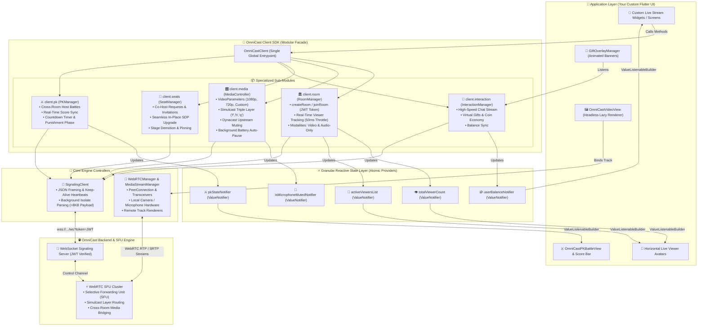

# 🚀 OmniCast Client Flutter SDK

[](https://pub.dev/packages/omnicast_client)
[](https://flutter.dev)
[](https://webrtc.org)
[](https://opensource.org/licenses/MIT)

An enterprise-grade, production-ready Flutter client library designed for building massive real-time live streaming applications like **TikTok Live**, **Bigo Live**, and **Twitch**. Powered by the **OmniCast Real-Time WebRTC SFU Engine**.

---

## 📑 Table of Contents

1. [🌟 High-Level Overview](#-high-level-overview)
2. [🏗️ Architectural Design (Headless & Modular)](#️-architectural-design-headless--modular)
3. [📦 Installation & Permissions](#-installation--permissions)
4. [🔑 Initialization & Auth](#-initialization--auth)
5. [🎥 Quick Start (Viewer & Host)](#-quick-start-viewer--host)
6. [🖼️ Headless Video Rendering (`OmniCastVideoView`)](#️-headless-video-rendering-omnicastvideoview)
7. [👥 Real-Time Viewer Tracking & Avatar Bar](#-real-time-viewer-tracking--avatar-bar)
8. [🏷️ Custom Dynamic Metadata (VIP Badges, Levels, Frames)](#️-custom-dynamic-metadata-vip-badges-levels-frames)
9. [🎛️ Media Quality, Simulcast & Dynacast](#️-media-quality-simulcast--dynacast)
10. [🔋 Battery & Hardware Lifecycle Optimization](#-battery--hardware-lifecycle-optimization)
11. [🎤 Multi-Guest Stage & Co-Hosting](#-multi-guest-stage--co-hosting)
12. [🎁 Chat, Gifts & Animated Overlay](#-chat-gifts--animated-overlay)
13. [⚔️ Host vs Host PK Battle System](#️-host-vs-host-pk-battle-system)
14. [📱 Full Complete Working Screen Example](#-full-complete-working-screen-example)

---

## 🌟 High-Level Overview

OmniCast Flutter SDK is built with two core philosophies:
- **100% Headless UI Freedom**: The SDK provides state and controllers. You have 100% freedom over your design—no forced layouts, no rigid widgets.
- **Extreme Hardware Performance**: Lazy WebRTC renderer allocation, aggressive memory cleanup, background battery saving, and isolate-based JSON parsing for 10,000+ participant rooms.



---

## 📦 Installation & Permissions

### 1. Add dependency to `pubspec.yaml`
```yaml
dependencies:
  flutter:
    sdk: flutter
  omnicast_client: ^0.0.1
```

```bash
flutter pub get
```

### 2. Configure Native Permissions

#### iOS (`ios/Runner/Info.plist`)
```xml
<key>NSCameraUsageDescription</key>
<string>Camera access is required for broadcasting live video.</string>
<key>NSMicrophoneUsageDescription</key>
<string>Microphone access is required for live audio streaming.</string>
```

#### Android (`android/app/src/main/AndroidManifest.xml`)
```xml
<uses-permission android:name="android.permission.CAMERA" />
<uses-permission android:name="android.permission.RECORD_AUDIO" />
<uses-permission android:name="android.permission.INTERNET" />
<uses-permission android:name="android.permission.MODIFY_AUDIO_SETTINGS" />
```

---

## 🔑 Initialization & Auth (Token-Based Security)

OmniCast uses secure, server-generated **JWT tokens** for room authentication rather than exposing raw API secrets on the mobile client. 

Initialize the SDK globally with only your SFU cluster host URL:

```dart
import 'package:omnicast_client/omnicast_client.dart';

final client = await OmniCastClient.init(
  hostUrl: 'wss://omnilive.lolipoplive.top/ws',
);
```

---

## 🎥 Quick Start (Viewer & Host)

### 1. Join a Live Room as a Viewer
Connects to the room with `recvonly` audio/video transceivers using a JWT token generated by your backend:

```dart
await client.room.joinRoom(
  roomId: 'room_101',
  userId: 'viewer_user_88',
  token: 'eyJhbGciOiJIUzI1NiIsInR5cCI6IkpXVCJ9...', // JWT auth token
);
```

### 2. Start a Live Broadcast as a Host
Captures hardware camera & mic, enables Simulcast, and begins publishing stream:

```dart
await client.room.createRoom(
  roomId: 'room_101',
  userId: 'host_user_42',
  token: 'eyJhbGciOiJIUzI1NiIsInR5cCI6IkpXVCJ9...', // JWT auth token
  options: const RoomOptions(
    title: 'Acoustic Guitar Live 🎸',
    enableAudio: true,
    enableVideo: true,
    enableSimulcast: true,
    enableDynacast: true,
    maxCoHosts: 4,
  ),
);
```

### 3. Leave Room
Cleanly stops hardware capture, shuts down PeerConnection, and cleans up state:

```dart
await client.room.leaveRoom();
```

---

## 🖼️ Headless Video Rendering (`OmniCastVideoView`)

The `OmniCastVideoView` widget is lightweight and un-opinionated. It has no forced borders, backgrounds, or aspect ratios.

- **Lazy Renderer Allocation**: Allocates `RTCVideoRenderer` only when the widget is mounted in `initState`.
- **Aggressive Disposal**: Clears `srcObject = null` and disposes the renderer immediately in `dispose()` to prevent VRAM memory leaks.

```dart
// 1. Render Local Camera (Host / Co-Host preview)
OmniCastVideoView(
  mediaStreamManager: client.streamManager,
  userId: 'local', // or null
  mirror: true,
  objectFit: RTCVideoViewObjectFit.RTCVideoViewObjectFitCover,
)

// 2. Render Remote Host or Guest Stream
OmniCastVideoView(
  mediaStreamManager: client.streamManager,
  userId: hostUserId, // Remote peer ID
  objectFit: RTCVideoViewObjectFit.RTCVideoViewObjectFitCover,
  placeholder: const Center(
    child: CircularProgressIndicator(),
  ),
)
```

---

## 👥 Real-Time Viewer Tracking & Avatar Bar

`client.room` provides real-time tracking for viewer counts and participant avatars with **50ms micro-batching debouncing** to prevent UI thread jank in 10,000+ viewer streams:

```dart
class LiveViewerHeader extends StatelessWidget {
  final OmniCastClient client;

  const LiveViewerHeader({super.key, required this.client});

  @override
  Widget build(BuildContext context) {
    return Row(
      children: [
        // 1. Live Viewer Count Badge (Rebuilds atomically)
        ValueListenableBuilder<int>(
          valueListenable: client.room.totalViewerCount,
          builder: (context, count, _) {
            return Container(
              padding: const EdgeInsets.symmetric(horizontal: 10, vertical: 4),
              decoration: BoxDecoration(
                color: Colors.black54,
                borderRadius: BorderRadius.circular(14),
              ),
              child: Text('👁️ $count', style: const TextStyle(color: Colors.white)),
            );
          },
        ),

        const SizedBox(width: 8),

        // 2. Horizontal Avatar List (Top active viewers in memory)
        Expanded(
          child: SizedBox(
            height: 36,
            child: ValueListenableBuilder<List<OmniCastParticipant>>(
              valueListenable: client.room.activeViewersList,
              builder: (context, viewers, _) {
                return ListView.builder(
                  scrollDirection: Axis.horizontal,
                  itemCount: viewers.length,
                  itemBuilder: (context, index) {
                    final user = viewers[index];
                    return Padding(
                      padding: const EdgeInsets.symmetric(horizontal: 2),
                      child: CircleAvatar(
                        radius: 16,
                        backgroundImage: user.avatarUrl != null ? NetworkImage(user.avatarUrl!) : null,
                        child: user.avatarUrl == null ? Text(user.displayName?[0] ?? '?') : null,
                      ),
                    );
                  },
                );
              },
            ),
          ),
        ),
      ],
    );
  }
}
```

---

## 🏷️ Custom Dynamic Metadata (VIP Badges, Levels, Frames)

The SFU engine and SDK support custom arbitrary JSON metadata on joining or publishing. This allows you to attach gamer levels, VIP statuses, animated avatar frames, or entrance effects.

### 1. Send Metadata When Joining as a Viewer
```dart
await client.room.joinRoom(
  roomId: 'room_101',
  userId: 'user_777',
  token: 'eyJhbGciOiJIUzI1NiIsInR5cCI6IkpXVCJ9...',
  metadata: {
    'level': 50,
    'is_vip': true,
    'badge': 'diamond',
    'frame_color': '#FFD700',
  },
);
```

### 2. Send Metadata When Broadcasting as Host
```dart
await client.media.startAsHost(
  roomId: 'room_101',
  userId: 'host_42',
  token: 'eyJhbGciOiJIUzI1NiIsInR5cCI6IkpXVCJ9...',
  metadata: {
    'verified': true,
    'tag': 'Official Creator 🌟',
  },
);
```

### 3. Read Metadata & Render Custom VIP Badges / Levels in UI
```dart
ValueListenableBuilder<List<OmniCastParticipant>>(
  valueListenable: client.room.activeViewersList,
  builder: (context, viewers, _) {
    return ListView.builder(
      scrollDirection: Axis.horizontal,
      itemCount: viewers.length,
      itemBuilder: (context, index) {
        final viewer = viewers[index];
        final isVip = viewer.metadata['is_vip'] == true;
        final level = viewer.metadata['level'] ?? 1;

        return Stack(
          alignment: Alignment.bottomRight,
          children: [
            // User Avatar
            CircleAvatar(
              radius: 18,
              backgroundImage: viewer.avatarUrl != null ? NetworkImage(viewer.avatarUrl!) : null,
              child: viewer.avatarUrl == null ? Text(viewer.displayName?[0] ?? '?') : null,
            ),

            // VIP Badge Icon
            if (isVip)
              const Positioned(
                top: 0,
                right: 0,
                child: Icon(Icons.verified, size: 14, color: Colors.amberAccent),
              ),

            // Level Tag
            Container(
              padding: const EdgeInsets.symmetric(horizontal: 4, vertical: 1),
              decoration: BoxDecoration(
                color: isVip ? Colors.purple : Colors.blueGrey,
                borderRadius: BorderRadius.circular(6),
              ),
              child: Text(
                'Lv.$level',
                style: const TextStyle(fontSize: 8, color: Colors.white, fontWeight: FontWeight.bold),
              ),
            ),
          ],
        );
      },
    );
  },
)
```

---

## 🎛️ Media Quality, Simulcast & Dynacast

`client.media` provides control over video resolutions, multi-layer simulcast, and adaptive bandwidth optimization.

### 1. Video Resolution Presets (`VideoParameters`)
```dart
// Apply 1080p FHD preset
await client.media.setVideoParameters(VideoParameters.presetFHD1080p);

// Or 720p HD standard
await client.media.setVideoParameters(VideoParameters.presetHD720p);

// Or Custom Resolution & Framerate
await client.media.setVideoParameters(
  VideoParameters.custom(width: 1080, height: 1920, fps: 60, maxBitrate: 4500000),
);
```

### 2. Multi-Layer Simulcast (`'f'`, `'h'`, `'q'`)
When Simulcast is enabled, the broadcaster sends 3 spatial layers:
- `'f'` (Full HD / 1080p)
- `'h'` (Half HD / 720p)
- `'q'` (Quarter / 360p)

```dart
// Viewer requests specific quality layer:
client.media.setSimulcastLayer('h');
```

### 3. Dynacast (Smart Publisher Layer Muting)
If no viewers in the room are watching the full 1080p (`'f'`) layer, Dynacast automatically pauses sending that layer upstream, saving up to **60% upload bandwidth** for the host:

```dart
client.media.enableDynacast(true);
```

---

## 🔋 Battery & Hardware Lifecycle Optimization

`MediaController` integrates Flutter's `WidgetsBindingObserver`. When your mobile app is sent to the background (user switches apps or locks screen), it automatically pauses the camera to prevent phone overheating and battery drain:

```dart
// Enabled by default (autoPauseOnBackground: true)
// When app goes to background -> Pauses local camera track
// When app returns to foreground -> Resumes camera track seamlessly
```

---

## 🎤 Multi-Guest Stage & Co-Hosting

Co-hosting uses **Seamless In-Place SDP Renegotiation**. Upgrading a viewer to co-host does **NOT** drop or recreate the WebRTC connection:

```dart
// Host invites viewer to stage
client.seats.inviteToCoHost('viewer_user_99', seatIndex: 1);

// Viewer accepts invitation and seamlessly turns on camera & mic
await client.seats.acceptCoHostInvite(video: true, audio: true);

// Host can demote guest back to viewer without kicking them from room
client.seats.demoteToViewer('cohost_user_99');

// Host can spotlight/pin a guest to the main stage for all viewers
client.seats.pinToMainStage('cohost_user_99');
```

---

## 🎁 Chat, Gifts & Animated Overlay

### 1. Send Chat & Virtual Gifts
```dart
// Send chat
client.interaction.sendChat('Hello everyone! Amazing stream ❤️');

// Send gift
client.interaction.sendGift(
  giftId: 'super_rocket',
  giftName: 'Super Rocket 🚀',
  amount: 5,
  coinValue: 100,
);
```

### 2. Gift Banner Overlay Widget (`GiftOverlayManager`)
Wrap your live stream in `GiftOverlayManager`. When gifts arrive, animated sliding banners with combo counters (`x5`) slide in and auto-dismiss after 3 seconds:

```dart
GiftOverlayManager(
  giftStream: client.interaction.onGiftReceived,
  displayDuration: const Duration(seconds: 3),
  child: OmniCastVideoView(
    mediaStreamManager: client.streamManager,
    userId: hostId,
  ),
)
```

---

## ⚔️ Host vs Host PK Battle System

Connect two hosts from different rooms into a unified split-screen battle with real-time score tracking:

### 1. Challenge & Accept PK
```dart
// Host A: Challenge Host B in another room
client.pk.sendPKRequest(
  targetRoomId: 'room_opponent_202',
  targetHostId: 'host_opponent_99',
  durationSeconds: 300, // 5 minute battle
);

// Host B: Accept challenge
client.pk.acceptPKRequest('pk_battle_id');
```

### 2. Render Split-Screen PK View (`OmniCastPKBattleView`)
```dart
OmniCastPKBattleView(
  mediaStreamManager: client.streamManager,
  hostUserId: 'my_host_id',
  opponentUserId: client.state.pkState.opponentUserId ?? '',
  pkState: client.state.pkState,
  hostDisplayName: 'Alice (Host)',
  opponentDisplayName: 'Bob (Opponent)',
)
```

### 3. Dynamic Animated Score Bar (`PKScoreProgressBar`)
```dart
PKScoreProgressBar(
  pkState: client.state.pkState,
  height: 28.0,
  hostGradient: const LinearGradient(colors: [Color(0xFF00C6FF), Color(0xFF0072FF)]),
  opponentGradient: const LinearGradient(colors: [Color(0xFFFF0844), Color(0xFFFFB199)]),
)
```

---

## 📱 Full Complete Working Screen Example

Here is a full, copy-pasteable Flutter live streaming screen demonstrating video rendering, real-time viewer bar, chat list, and gift animations:

```dart
import 'package:flutter/material.dart';
import 'package:omnicast_client/omnicast_client.dart';

class LiveStreamScreen extends StatefulWidget {
  final String roomId;
  final String userId;
  final bool isHost;

  const LiveStreamScreen({
    super.key,
    required this.roomId,
    required this.userId,
    this.isHost = false,
  });

  @override
  State<LiveStreamScreen> createState() => _LiveStreamScreenState();
}

class _LiveStreamScreenState extends State<LiveStreamScreen> {
  late final OmniCastClient client;
  final TextEditingController _chatController = TextEditingController();
  bool _isReady = false;

  @override
  void initState() {
    super.initState();
    _initSDK();
  }

  Future<void> _initSDK() async {
    // 1. Initialize SDK (No API secrets exposed)
    client = await OmniCastClient.init(
      hostUrl: 'wss://omnilive.lolipoplive.top/ws',
    );

    // 2. Obtain secure JWT token from your application backend
    const jwtToken = 'YOUR_BACKEND_GENERATED_JWT_TOKEN';

    // 3. Join or Host using token
    if (widget.isHost) {
      await client.room.createRoom(
        roomId: widget.roomId,
        userId: widget.userId,
        token: jwtToken,
        options: const RoomOptions(enableSimulcast: true, enableDynacast: true),
      );
    } else {
      await client.room.joinRoom(
        roomId: widget.roomId,
        userId: widget.userId,
        token: jwtToken,
      );
    }

    if (mounted) setState(() => _isReady = true);
  }

  @override
  void dispose() {
    client.dispose();
    _chatController.dispose();
    super.dispose();
  }

  @override
  Widget build(BuildContext context) {
    if (!_isReady) {
      return const Scaffold(
        backgroundColor: Colors.black,
        body: Center(child: CircularProgressIndicator(color: Colors.white)),
      );
    }

    return Scaffold(
      backgroundColor: Colors.black,
      body: GiftOverlayManager(
        giftStream: client.interaction.onGiftReceived,
        child: Stack(
          children: [
            // 1. Fullscreen Video (Local Host Camera or Remote Stream)
            Positioned.fill(
              child: OmniCastVideoView(
                mediaStreamManager: client.streamManager,
                userId: widget.isHost ? 'local' : (client.state.hostId ?? 'remote_peer'),
                mirror: widget.isHost,
                objectFit: RTCVideoViewObjectFit.RTCVideoViewObjectFitCover,
              ),
            ),

            // 2. Top Header: Viewers & Coins
            Positioned(
              top: 48,
              left: 16,
              right: 16,
              child: Row(
                children: [
                  // Viewer count badge
                  ValueListenableBuilder<int>(
                    valueListenable: client.room.totalViewerCount,
                    builder: (context, count, _) => Container(
                      padding: const EdgeInsets.symmetric(horizontal: 10, vertical: 5),
                      decoration: BoxDecoration(
                        color: Colors.black54,
                        borderRadius: BorderRadius.circular(16),
                      ),
                      child: Text('👁️ $count', style: const TextStyle(color: Colors.white)),
                    ),
                  ),
                  const SizedBox(width: 8),

                  // Active Viewers Avatars
                  Expanded(
                    child: SizedBox(
                      height: 32,
                      child: ValueListenableBuilder<List<OmniCastParticipant>>(
                        valueListenable: client.room.activeViewersList,
                        builder: (context, viewers, _) => ListView.builder(
                          scrollDirection: Axis.horizontal,
                          itemCount: viewers.length,
                          itemBuilder: (context, i) => Padding(
                            padding: const EdgeInsets.only(right: 4),
                            child: CircleAvatar(
                              radius: 16,
                              backgroundColor: Colors.indigoAccent,
                              child: Text(viewers[i].displayName?[0] ?? '?', style: const TextStyle(fontSize: 12)),
                            ),
                          ),
                        ),
                      ),
                    ),
                  ),
                ],
              ),
            ),

            // 3. Bottom Chat List
            Positioned(
              left: 16,
              right: 100,
              bottom: 80,
              height: 200,
              child: StreamBuilder<ChatMessage>(
                stream: client.interaction.chatStream,
                builder: (context, snapshot) {
                  final messages = client.state.chatHistory;
                  return ListView.builder(
                    itemCount: messages.length,
                    itemBuilder: (context, index) {
                      final chat = messages[index];
                      return Container(
                        margin: const EdgeInsets.symmetric(vertical: 2),
                        padding: const EdgeInsets.symmetric(horizontal: 8, vertical: 4),
                        decoration: BoxDecoration(
                          color: Colors.black45,
                          borderRadius: BorderRadius.circular(8),
                        ),
                        child: RichText(
                          text: TextSpan(
                            children: [
                              TextSpan(text: '${chat.senderName}: ', style: const TextStyle(fontWeight: FontWeight.bold, color: Colors.amberAccent)),
                              TextSpan(text: chat.text, style: const TextStyle(color: Colors.white)),
                            ],
                          ),
                        ),
                      );
                    },
                  );
                },
              ),
            ),

            // 4. Bottom Controls & Send Gift
            Positioned(
              left: 16,
              right: 16,
              bottom: 20,
              child: Row(
                children: [
                  Expanded(
                    child: TextField(
                      controller: _chatController,
                      style: const TextStyle(color: Colors.white),
                      decoration: InputDecoration(
                        hintText: 'Say something...',
                        hintStyle: const TextStyle(color: Colors.white54),
                        filled: true,
                        fillColor: Colors.black54,
                        border: OutlineInputBorder(borderRadius: BorderRadius.circular(24)),
                        contentPadding: const EdgeInsets.symmetric(horizontal: 16),
                      ),
                      onSubmitted: (text) {
                        if (text.trim().isNotEmpty) {
                          client.interaction.sendChat(text.trim());
                          _chatController.clear();
                        }
                      },
                    ),
                  ),
                  const SizedBox(width: 8),

                  // Gift Button
                  IconButton(
                    icon: const Icon(Icons.card_giftcard, color: Colors.amberAccent, size: 28),
                    onPressed: () {
                      client.interaction.sendGift(
                        giftId: 'rose_1',
                        giftName: 'Rose 🌹',
                        amount: 1,
                        coinValue: 10,
                      );
                    },
                  ),
                ],
              ),
            ),
          ],
        ),
      ),
    );
  }
}
```

---

## 📄 License

This SDK is distributed under the MIT License. See [LICENSE](LICENSE) for details.
