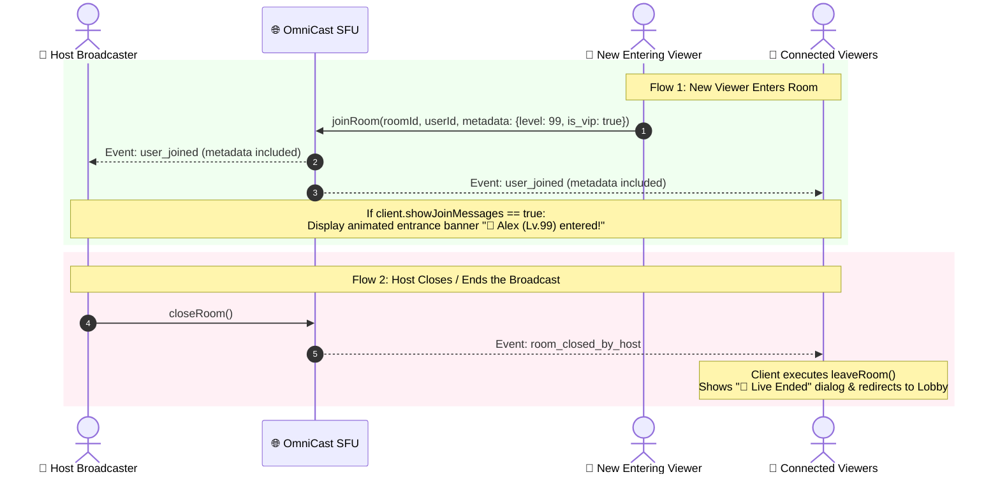

# 🎪 OmniCast SDK: Room Closure, Viewers List & Toggleable Entrance Banners Guide

Comprehensive developer guide on:
1. **How Host Closes the Live Room & Automatically Disconnects All Participants**
2. **How to View the Real-Time Viewers List & Metadata**
3. **How to Display & Toggle (Turn On/Off) Room Enter / Join Notifications**

---

## 📑 Table of Contents
1. [Architecture & Lifecycle Overview](#1-architecture--lifecycle-overview)
2. [1. Host Ending the Room & Ejecting All Viewers](#2-1-host-ending-the-room--ejecting-all-viewers)
3. [2. Viewing the Real-Time Viewers List](#3-2-viewing-the-real-time-viewers-list)
   - [A. 1-Line Pre-built Modal Bottom Sheet](#a-1-line-pre-built-modal-bottom-sheet)
   - [B. Top Bar Horizontal Avatars Row](#b-top-bar-horizontal-avatars-row)
4. [3. Real-Time Room Entrance Messages & On/Off Toggle](#4-3-real-time-room-entrance-messages--onoff-toggle)
   - [A. Entrance Event Stream & Data](#a-entrance-event-stream--data)
   - [B. Toggling Entrance Messages On/Off (Host & Settings)](#b-toggling-entrance-messages-onoff-host--settings)
   - [C. Animated Sliding Entrance Banner Widget](#c-animated-sliding-entrance-banner-widget)
5. [Complete Ready-to-Use Flutter UI Screen Example](#5-complete-ready-to-use-flutter-ui-screen-example)

---

## 1. Architecture & Lifecycle Overview



---

## 2. 1. Host Ending the Room & Ejecting All Viewers

When the host terminates the broadcast, the SDK ensures that all viewers are disconnected cleanly, media streams are stopped, and everyone is navigated back to the lobby.

### A. Host Triggers Room Closure:
```dart
// Host calls closeRoom():
await client.closeRoom();
```

### B. Viewers Automatically Handle Closure:
Every viewer inside the room listens to `client.onRoomClosedByHost`. When this fires, the SDK tears down their WebRTC connection and you can present a friendly "Live Ended" modal:

```dart
@override
void initState() {
  super.initState();

  // Listen for host ending the room:
  _client.onRoomClosedByHost.listen((reason) {
    if (!mounted) return;

    // 1. Teardown viewer tracks & resources
    _client.leaveRoom();

    // 2. Show Live Ended Dialog and navigate back to Lobby
    showDialog(
      context: context,
      barrierDismissible: false,
      builder: (ctx) => AlertDialog(
        backgroundColor: const Color(0xFF1E293B),
        shape: RoundedRectangleBorder(borderRadius: BorderRadius.circular(20)),
        title: const Text('🔴 Live Stream Ended', style: TextStyle(color: Colors.white)),
        content: const Text(
          'The host has finished the broadcast. Thank you for watching!',
          style: TextStyle(color: Colors.white70),
        ),
        actions: [
          ElevatedButton(
            style: ElevatedButton.styleFrom(
              backgroundColor: const Color(0xFF6366F1),
              shape: RoundedRectangleBorder(borderRadius: BorderRadius.circular(12)),
            ),
            onPressed: () {
              Navigator.pop(ctx);
              Navigator.pop(context); // Return to Lobby screen
            },
            child: const Text('Back to Lobby', style: TextStyle(color: Colors.white)),
          ),
        ],
      ),
    );
  });
}
```

---

## 3. 2. Viewing the Real-Time Viewers List

### A. 1-Line Pre-built Modal Bottom Sheet
The fastest and cleanest way is using the SDK's built-in `OmniCastViewersBottomSheet`:

```dart
// Opens full viewers bottom sheet in 1 line of code!
OmniCastViewersBottomSheet.show(context, client: _client);
```

#### ✨ Built-in Features:
- **Live Sync**: Real-time join/leave updates via debounced notifiers.
- **Rich Metadata**: Automatically renders user avatars, display names, `Lv.99` badges, and golden VIP badges.
- **Host Moderation**: If current user is Host, displays red **Kick** button with reason selection popup.

---

### B. Top Bar Horizontal Avatars Row
To render a compact row of viewer avatars at the top of your live screen:

```dart
Widget buildLiveViewerAvatarsRow(BuildContext context, OmniCastClient client) {
  return ValueListenableBuilder<List<OmniCastParticipant>>(
    valueListenable: client.activeViewersList,
    builder: (context, viewers, _) {
      return Row(
        mainAxisSize: MainAxisSize.min,
        children: [
          // Total Counter Badge
          GestureDetector(
            onTap: () => OmniCastViewersBottomSheet.show(context, client: client),
            child: Container(
              padding: const EdgeInsets.symmetric(horizontal: 8, vertical: 4),
              decoration: BoxDecoration(
                color: Colors.black54,
                borderRadius: BorderRadius.circular(12),
              ),
              child: Text(
                '👥 ${client.totalViewerCount.value}',
                style: const TextStyle(color: Colors.white, fontSize: 12, fontWeight: FontWeight.bold),
              ),
            ),
          ),
          const SizedBox(width: 8),

          // Horizontal Avatars List
          SizedBox(
            height: 32,
            child: ListView.builder(
              shrinkWrap: true,
              scrollDirection: Axis.horizontal,
              itemCount: viewers.length > 5 ? 5 : viewers.length,
              itemBuilder: (context, index) {
                final viewer = viewers[index];
                return Padding(
                  padding: const EdgeInsets.only(right: 4.0),
                  child: GestureDetector(
                    onTap: () => OmniCastViewersBottomSheet.show(context, client: client),
                    child: CircleAvatar(
                      radius: 16,
                      backgroundImage: NetworkImage(
                        viewer.avatarUrl ?? 'https://api.dicebear.com/7.x/bottts/png?seed=${viewer.userId}',
                      ),
                    ),
                  ),
                );
              },
            ),
          ),
        ],
      );
    },
  );
}
```

---

## 4. 3. Real-Time Room Entrance Messages & On/Off Toggle

### A. Entrance Event Stream & Data
When a new participant joins, `client.onParticipantJoined` emits their profile and metadata:

```dart
_client.onParticipantJoined.listen((participant) {
  final name = participant.displayName ?? participant.userId;
  final level = participant.metadata['level'] ?? 1;
  final isVip = participant.metadata['is_vip'] ?? false;

  debugPrint('User joined: $name (Lv.$level, VIP: $isVip)');
});
```

---

### B. Toggling Entrance Messages On/Off (Host & Settings)

The SDK provides reactive toggles:
- **`client.showJoinMessages`** (`bool` getter/setter)
- **`client.showJoinMessagesNotifier`** (`ValueNotifier<bool>`)

#### Settings Toggle Switch in Live Room:
```dart
Widget buildEntranceMessageSettingTile(OmniCastClient client) {
  return ValueListenableBuilder<bool>(
    valueListenable: client.showJoinMessagesNotifier,
    builder: (context, isEnabled, _) {
      return SwitchListTile(
        title: const Text('Show Room Entrance Messages', style: TextStyle(color: Colors.white)),
        subtitle: const Text('Display banners when new viewers enter', style: TextStyle(color: Colors.white60)),
        value: isEnabled,
        activeColor: const Color(0xFF6366F1),
        onChanged: (newValue) {
          // 🔥 Toggle ON/OFF dynamically at runtime!
          client.showJoinMessages = newValue;
        },
      );
    },
  );
}
```

---

### C. Animated Sliding Entrance Banner Widget

Here is a ready-to-use sliding banner widget that listens to `client.onParticipantJoined` and only displays if `client.showJoinMessages == true`:

```dart
class LiveRoomEntranceBanner extends StatefulWidget {
  final OmniCastClient client;

  const LiveRoomEntranceBanner({super.key, required this.client});

  @override
  State<LiveRoomEntranceBanner> createState() => _LiveRoomEntranceBannerState();
}

class _LiveRoomEntranceBannerState extends State<LiveRoomEntranceBanner>
    with SingleTickerProviderStateMixin {
  late AnimationController _controller;
  late Animation<Offset> _slideAnimation;
  OmniCastParticipant? _currentEnteringUser;
  StreamSubscription? _joinSub;

  @override
  void initState() {
    super.initState();
    _controller = AnimationController(
      vsync: this,
      duration: const Duration(milliseconds: 400),
    );
    _slideAnimation = Tween<Offset>(
      begin: const Offset(-1.2, 0.0), // Start offscreen left
      end: Offset.zero,
    ).animate(CurvedAnimation(parent: _controller, curve: Curves.easeOutBack));

    // Listen to new participants entering the room
    _joinSub = widget.client.onParticipantJoined.listen((participant) {
      // Check if entrance banners are enabled!
      if (!widget.client.showJoinMessages) return;

      _showEntranceBanner(participant);
    });
  }

  void _showEntranceBanner(OmniCastParticipant participant) async {
    setState(() => _currentEnteringUser = participant);
    await _controller.forward();
    await Future.delayed(const Duration(seconds: 3)); // Display for 3 seconds
    if (mounted) {
      await _controller.reverse();
      setState(() => _currentEnteringUser = null);
    }
  }

  @override
  void dispose() {
    _joinSub?.cancel();
    _controller.dispose();
    super.dispose();
  }

  @override
  Widget build(BuildContext context) {
    if (_currentEnteringUser == null) return const SizedBox.shrink();

    final name = _currentEnteringUser!.displayName ?? _currentEnteringUser!.userId;
    final level = _currentEnteringUser!.metadata['level'] ?? 1;
    final isVip = _currentEnteringUser!.metadata['is_vip'] == true;

    return SlideTransition(
      position: _slideAnimation,
      child: Container(
        margin: const EdgeInsets.only(left: 16, bottom: 8),
        padding: const EdgeInsets.symmetric(horizontal: 12, vertical: 6),
        decoration: BoxDecoration(
          gradient: LinearGradient(
            colors: isVip
                ? [const Color(0xFFF59E0B).withOpacity(0.9), const Color(0xFFD97706).withOpacity(0.9)]
                : [const Color(0xFF6366F1).withOpacity(0.85), const Color(0xFF4F46E5).withOpacity(0.85)],
          ),
          borderRadius: BorderRadius.circular(20),
          boxShadow: [
            BoxShadow(
              color: Colors.black.withOpacity(0.3),
              blurRadius: 8,
              offset: const Offset(0, 2),
            ),
          ],
        ),
        child: Row(
          mainAxisSize: MainAxisSize.min,
          children: [
            CircleAvatar(
              radius: 12,
              backgroundImage: NetworkImage(
                _currentEnteringUser!.avatarUrl ??
                    'https://api.dicebear.com/7.x/bottts/png?seed=${_currentEnteringUser!.userId}',
              ),
            ),
            const SizedBox(width: 8),
            Container(
              padding: const EdgeInsets.symmetric(horizontal: 6, vertical: 2),
              decoration: BoxDecoration(
                color: Colors.black38,
                borderRadius: BorderRadius.circular(8),
              ),
              child: Text(
                'Lv.$level',
                style: const TextStyle(color: Colors.amberAccent, fontSize: 10, fontWeight: FontWeight.bold),
              ),
            ),
            const SizedBox(width: 6),
            Text(
              '👋 $name entered',
              style: const TextStyle(color: Colors.white, fontSize: 12, fontWeight: FontWeight.bold),
            ),
          ],
        ),
      ),
    );
  }
}
```

---

## 5. Complete Ready-to-Use Flutter UI Screen Example

```dart
import 'package:flutter/material.dart';
import 'package:omnicast_client/omnicast_client.dart';

class FullLiveRoomScreen extends StatefulWidget {
  final OmniCastClient client;

  const FullLiveRoomScreen({super.key, required this.client});

  @override
  State<FullLiveRoomScreen> createState() => _FullLiveRoomScreenState();
}

class _FullLiveRoomScreenState extends State<FullLiveRoomScreen> {
  @override
  void initState() {
    super.initState();

    // 1. Listen for host ending the live room
    widget.client.onRoomClosedByHost.listen((_) {
      if (!mounted) return;
      widget.client.leaveRoom();
      ScaffoldMessenger.of(context).showSnackBar(
        const SnackBar(content: Text('The host has ended this live broadcast.')),
      );
      Navigator.pop(context);
    });
  }

  @override
  Widget build(BuildContext context) {
    return Scaffold(
      backgroundColor: Colors.black,
      body: Stack(
        children: [
          // 1. Video Canvas
          Positioned.fill(
            child: OmniCastVideoCanvas(client: widget.client),
          ),

          // 2. Top Bar: Viewers & End Button
          Positioned(
            top: 48,
            left: 16,
            right: 16,
            child: Row(
              mainAxisAlignment: MainAxisAlignment.spaceBetween,
              children: [
                // Tap to view viewers sheet
                GestureDetector(
                  onTap: () => OmniCastViewersBottomSheet.show(context, client: widget.client),
                  child: Container(
                    padding: const EdgeInsets.symmetric(horizontal: 10, vertical: 6),
                    decoration: BoxDecoration(color: Colors.black54, borderRadius: BorderRadius.circular(16)),
                    child: ValueListenableBuilder<int>(
                      valueListenable: widget.client.totalViewerCount,
                      builder: (context, count, _) => Text(
                        '👥 $count Viewers',
                        style: const TextStyle(color: Colors.white, fontSize: 12, fontWeight: FontWeight.bold),
                      ),
                    ),
                  ),
                ),

                // Close Room / Exit
                IconButton(
                  icon: const Icon(Icons.close, color: Colors.white),
                  onPressed: () async {
                    if (widget.client.state.isHost) {
                      await widget.client.closeRoom();
                    } else {
                      await widget.client.leaveRoom();
                    }
                    if (context.mounted) Navigator.pop(context);
                  },
                ),
              ],
            ),
          ),

          // 3. Sliding Entrance Banner (Bottom Left above chat)
          Positioned(
            bottom: 120,
            left: 0,
            child: LiveRoomEntranceBanner(client: widget.client),
          ),
        ],
      ),
    );
  }
}
```
