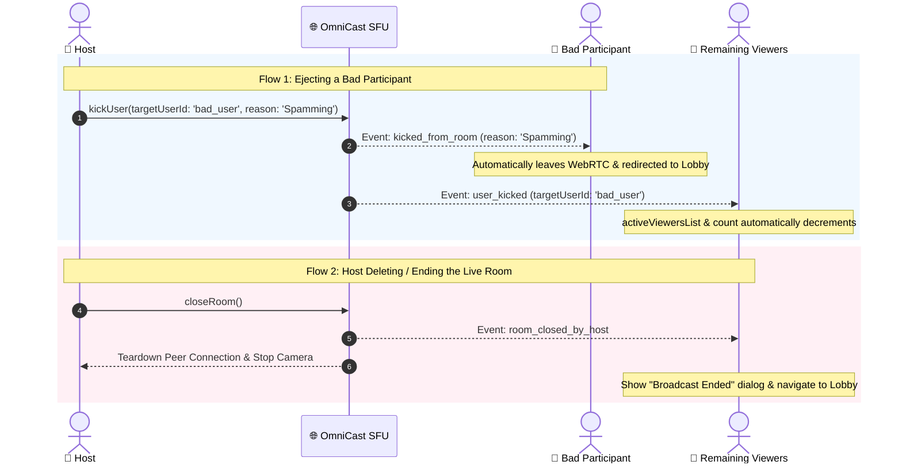

# 🚪 OmniCast SDK: Room Management & Participant Ejection Guide

Comprehensive developer guide on **Deleting/Ending a Live Room (`closeRoom`)** and **Forcefully Removing/Kicking Participants (`kickUser`)** in Flutter using the OmniCast SDK.

---

## 📑 Table of Contents
1. [Overview & Architecture](#1-overview--architecture)
2. [How to Delete / End a Room (Host Action)](#2-how-to-delete--end-a-room-host-action)
3. [Handling Room Termination (Viewers & Lobby)](#3-handling-room-termination-viewers--lobby)
4. [How to Remove / Kick a Participant from a Room](#4-how-to-remove--kick-a-participant-from-a-room)
   - [A. Method 1: 1-Line Built-in UI (Recommended)](#a-method-1-1-line-built-in-ui-recommended)
   - [B. Method 2: Programmatic Method Call](#b-method-2-programmatic-method-call)
5. [Handling Ejection Events (Kicked User & Room Viewers)](#5-handling-ejection-events-kicked-user--room-viewers)
6. [Stage Demotion vs Full Room Kick](#6-stage-demotion-vs-full-room-kick)
7. [Complete Flutter UI Implementation Example](#7-complete-flutter-ui-implementation-example)

---

## 1. Overview & Architecture



---

## 2. How to Delete / End a Room (Host Action)

When a broadcaster wants to terminate the live stream, call `client.closeRoom()`.

### What `client.closeRoom()` does automatically:
1. Sends the `room_closed` signaling event to the SFU server.
2. Broadcasters server-wide and in-room receive the termination event.
3. Automatically stops local camera and microphone hardware tracks.
4. Closes the WebRTC PeerConnection and resets reactive room states.

### Code:
```dart
// Host End Live Confirmation Dialog
void onHostEndLivePressed(BuildContext context, OmniCastClient client) {
  showDialog(
    context: context,
    builder: (ctx) => AlertDialog(
      backgroundColor: const Color(0xFF1E293B),
      shape: RoundedRectangleBorder(borderRadius: BorderRadius.circular(16)),
      title: const Text('End Broadcast?', style: TextStyle(color: Colors.white)),
      content: const Text(
        'Ending this broadcast will disconnect all viewers and co-hosts.',
        style: TextStyle(color: Colors.white70),
      ),
      actions: [
        TextButton(
          onPressed: () => Navigator.pop(ctx),
          child: const Text('Cancel', style: TextStyle(color: Colors.grey)),
        ),
        ElevatedButton(
          style: ElevatedButton.styleFrom(backgroundColor: Colors.redAccent),
          onPressed: () async {
            Navigator.pop(ctx);
            // 🔥 Terminate the room and notify all viewers
            await client.closeRoom();
            if (context.mounted) {
              Navigator.pop(context); // Return to Lobby
            }
          },
          child: const Text('End Live', style: TextStyle(color: Colors.white)),
        ),
      ],
    ),
  );
}
```

---

## 3. Handling Room Termination (Viewers & Lobby)

### In-Room Viewers Listener:
When the host closes the room, viewers listen to `client.onRoomClosedByHost`:

```dart
@override
void initState() {
  super.initState();

  // Listen for host ending the broadcast
  _client.onRoomClosedByHost.listen((reason) {
    if (!mounted) return;
    
    // Automatically close WebRTC tracks on viewer end
    _client.leaveRoom();

    showDialog(
      context: context,
      barrierDismissible: false,
      builder: (ctx) => AlertDialog(
        backgroundColor: const Color(0xFF1E293B),
        title: const Text('🔴 Live Ended', style: TextStyle(color: Colors.white)),
        content: const Text(
          'The host has ended this live stream.',
          style: TextStyle(color: Colors.white70),
        ),
        actions: [
          ElevatedButton(
            onPressed: () {
              Navigator.pop(ctx);
              Navigator.pop(context); // Navigate back to Lobby
            },
            child: const Text('Back to Lobby'),
          ),
        ],
      ),
    );
  });
}
```

### Global Lobby Listener:
In your main lobby screen, listen to `client.onRoomClosed` to instantly remove closed rooms from the grid:

```dart
_client.onRoomClosed.listen((closedRoomId) {
  setState(() {
    activeRooms.removeWhere((room) => room.roomId == closedRoomId);
  });
});
```

---

## 4. How to Remove / Kick a Participant from a Room

### A. Method 1: 1-Line Built-in UI (Recommended)

The easiest way is to use the built-in `OmniCastViewersBottomSheet`. It automatically checks if the user is Host, shows the **Kick** button, renders reason selection chips, and executes the ejection:

```dart
// Open viewers list with host moderation built-in!
OmniCastViewersBottomSheet.show(context, client: _client);
```

---

### B. Method 2: Programmatic Method Call

If you have custom UI (e.g. tapping a user profile popup or chat message), call `client.kickUser`:

```dart
// Kick target user with custom reason
_client.kickUser(
  'bad_user_123',
  reason: 'Violated community guidelines',
);
```

---

## 5. Handling Ejection Events (Kicked User & Room Viewers)

### 1. Handling on the Kicked User's Device:
When a user is kicked by the host, the SDK triggers `client.onKickedFromRoom`:

```dart
_client.onKickedFromRoom.listen((event) {
  if (!mounted) return;

  // 1. Leave WebRTC room session
  _client.leaveRoom();

  // 2. Show ejection explanation modal
  showDialog(
    context: context,
    barrierDismissible: false,
    builder: (ctx) => AlertDialog(
      backgroundColor: const Color(0xFF1E293B),
      shape: RoundedRectangleBorder(borderRadius: BorderRadius.circular(16)),
      title: const Text('🚫 Removed from Room', style: TextStyle(color: Colors.redAccent)),
      content: Text(
        'You have been removed by the host.\nReason: ${event.reason ?? "Violated room rules"}',
        style: const TextStyle(color: Colors.white70),
      ),
      actions: [
        ElevatedButton(
          onPressed: () {
            Navigator.pop(ctx);
            Navigator.pop(context); // Exit room to Lobby
          },
          child: const Text('OK'),
        ),
      ],
    ),
  );
});
```

### 2. Handling on Other Viewers' Devices:
Other viewers in the room can receive notifications via `client.onUserKicked`:

```dart
_client.onUserKicked.listen((event) {
  ScaffoldMessenger.of(context).showSnackBar(
    SnackBar(
      content: Text('⚠️ User ${event.targetUserId} was removed by host.'),
      backgroundColor: Colors.red.shade900,
      duration: const Duration(seconds: 2),
    ),
  );
});
```

---

## 6. Stage Demotion vs Full Room Kick

| Action | SDK Method | Result |
| :--- | :--- | :--- |
| **Demote from Stage** | `client.seats.kickFromStage(userId)` | Removes user's camera/mic from the stage and turns them back into a normal viewer in the audience. |
| **Mute Co-Host Mic** | `client.seats.muteCoHost(userId)` | Remotely mutes co-host's microphone. |
| **Turn Off Co-Host Camera** | `client.seats.disableCoHostCamera(userId)` | Remotely disables co-host's video camera. |
| **Full Room Ejection** | `client.kickUser(userId, reason: '...')` | Completely kicks the user out of the room back to the lobby. |

---

## 7. Complete Flutter UI Implementation Example

```dart
import 'package:flutter/material.dart';
import 'package:omnicast_client/omnicast_client.dart';

class LiveRoomControlsOverlay extends StatelessWidget {
  final OmniCastClient client;

  const LiveRoomControlsOverlay({super.key, required this.client});

  @override
  Widget build(BuildContext context) {
    final isHost = client.state.isHost;

    return Positioned(
      top: 40,
      left: 16,
      right: 16,
      child: Row(
        mainAxisAlignment: MainAxisAlignment.spaceBetween,
        children: [
          // 1. Viewers Counter (Tap to open moderation sheet)
          GestureDetector(
            onTap: () => OmniCastViewersBottomSheet.show(context, client: client),
            child: Container(
              padding: const EdgeInsets.symmetric(horizontal: 10, vertical: 6),
              decoration: BoxDecoration(
                color: Colors.black54,
                borderRadius: BorderRadius.circular(16),
              ),
              child: ValueListenableBuilder<int>(
                valueListenable: client.totalViewerCount,
                builder: (context, count, _) => Row(
                  children: [
                    const Icon(Icons.remove_red_eye, color: Colors.white, size: 14),
                    const SizedBox(width: 4),
                    Text('$count', style: const TextStyle(color: Colors.white, fontSize: 12)),
                  ],
                ),
              ),
            ),
          ),

          // 2. Close / Exit Button
          IconButton(
            icon: const Icon(Icons.close, color: Colors.white, size: 28),
            onPressed: () {
              if (isHost) {
                _showEndRoomDialog(context);
              } else {
                client.leaveRoom();
                Navigator.pop(context);
              }
            },
          ),
        ],
      ),
    );
  }

  void _showEndRoomDialog(BuildContext context) {
    showDialog(
      context: context,
      builder: (ctx) => AlertDialog(
        backgroundColor: const Color(0xFF1E293B),
        title: const Text('End Broadcast?', style: TextStyle(color: Colors.white)),
        content: const Text(
          'Are you sure you want to end this live stream for all viewers?',
          style: TextStyle(color: Colors.white70),
        ),
        actions: [
          TextButton(
            onPressed: () => Navigator.pop(ctx),
            child: const Text('Cancel', style: TextStyle(color: Colors.grey)),
          ),
          ElevatedButton(
            style: ElevatedButton.styleFrom(backgroundColor: Colors.redAccent),
            onPressed: () async {
              Navigator.pop(ctx);
              await client.closeRoom();
              if (context.mounted) Navigator.pop(context);
            },
            child: const Text('End Live'),
          ),
        ],
      ),
    );
  }
}
```
