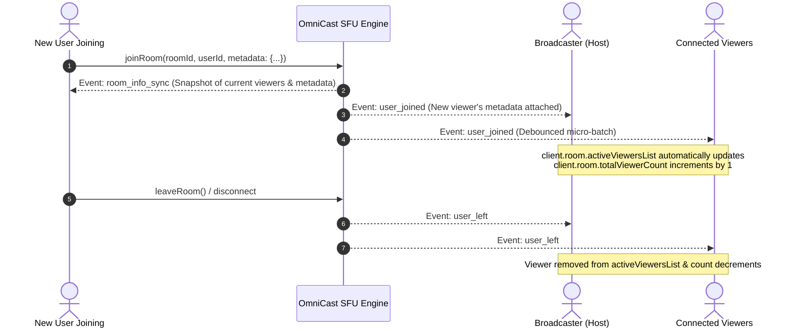

# 👥 OmniCast SDK: Viewers & Metadata Integration Guide

Comprehensive guide on accessing, tracking, and rendering **Real-Time Viewers, Active Participants, and Custom User Metadata** (Level, VIP Status, Badges, Coins, Avatars) in the OmniCast Flutter SDK.

---

## 📑 Table of Contents
1. [Overview & State Access Points](#1-overview--state-access-points)
2. [Data Model: `OmniCastParticipant`](#2-data-model-omnicastparticipant)
3. [Passing Metadata When Joining a Room](#3-passing-metadata-when-joining-a-room)
4. [Real-Time Lifecycle & State Sync](#4-real-time-lifecycle--state-sync)
5. [Flutter UI Integration Examples](#5-flutter-ui-integration-examples)
   - [A. Real-Time Viewers Modal Bottom Sheet (With VIP & Levels)](#a-real-time-viewers-modal-bottom-sheet)
   - [B. Horizontal Top-Bar Live Avatars Row](#b-horizontal-top-bar-live-avatars-row)
   - [C. Total Live Viewer Counter Badge](#c-total-live-viewer-counter-badge)
6. [Best Practices & Performance Tuning](#6-best-practices--performance-tuning)

---

## 1. Overview & State Access Points

The SDK continuously keeps the participant and viewer list synchronized in real time with the SFU server. Developers can consume this data through 3 reactive access points:

| Access Point | Type | Purpose |
| :--- | :--- | :--- |
| `client.room.activeViewersList` | `ValueNotifier<List<OmniCastParticipant>>` | **Recommended for UI.** Highly optimized reactive list with micro-batch debouncing (50ms) to eliminate frame drops. |
| `client.state.viewers` | `List<Participant>` | Snapshot list of current viewers stored in global `RoomState`. |
| `client.room.totalViewerCount` | `ValueNotifier<int>` | Total number of viewers currently in the room (can exceed in-memory list size). |

---

## 2. Data Model: `OmniCastParticipant`

```dart
class OmniCastParticipant {
  final String userId;                 // Unique User Identifier
  final String? displayName;           // User nickname / display name
  final String? avatarUrl;             // Profile picture URL
  final UserRole role;                 // Role: UserRole.viewer, UserRole.host, UserRole.coHost
  final bool isAudioMuted;             // Audio track state
  final bool isVideoMuted;             // Video track state
  final DateTime joinedAt;             // Join timestamp
  final Map<String, dynamic> metadata; // Custom metadata payload (Levels, Badges, VIP, etc.)
}

/// Backward compatibility alias
typedef Participant = OmniCastParticipant;
```

---

## 3. Passing Metadata When Joining a Room

When a user joins a live room as a viewer or host, arbitrary JSON-compatible metadata can be attached via `client.room.joinRoom()` or `client.room.createRoom()`:

```dart
await client.room.joinRoom(
  roomId: 'room_7057',
  userId: 'user_8588',
  metadata: {
    'displayName': 'Alex Johnson',
    'avatar': 'https://api.dicebear.com/7.x/bottts/png?seed=user_8588',
    'level': 99,
    'is_vip': true,
    'badge': '👑 Diamond Supporter',
    'country': 'BD',
    'role_title': 'Moderator',
  },
);
```

---

## 4. Real-Time Lifecycle & State Sync



---

## 5. Flutter UI Integration Examples

### A. Real-Time Viewers Modal Bottom Sheet

A complete modal displaying viewer avatars, level badges, VIP icons, and host moderation actions:

```dart
import 'package:flutter/material.dart';
import 'package:omnicast_client/omnicast_client.dart';

void showViewersListModal(BuildContext context, OmniCastClient client) {
  showModalBottomSheet(
    context: context,
    backgroundColor: const Color(0xFF0F172A),
    shape: const RoundedRectangleBorder(
      borderRadius: BorderRadius.vertical(top: Radius.circular(24)),
    ),
    builder: (ctx) {
      return ValueListenableBuilder<List<OmniCastParticipant>>(
        valueListenable: client.room.activeViewersList,
        builder: (context, viewers, _) {
          return Padding(
            padding: const EdgeInsets.symmetric(horizontal: 16, vertical: 20),
            child: Column(
              mainAxisSize: MainAxisSize.min,
              children: [
                // Header: Title & Total Count
                Row(
                  mainAxisAlignment: MainAxisAlignment.spaceBetween,
                  children: [
                    Row(
                      children: [
                        const Icon(Icons.people_alt_rounded, color: Colors.indigoAccent, size: 22),
                        const SizedBox(width: 8),
                        Text(
                          'Live Viewers (${viewers.length})',
                          style: const TextStyle(
                            color: Colors.white,
                            fontSize: 18,
                            fontWeight: FontWeight.bold,
                          ),
                        ),
                      ],
                    ),
                    IconButton(
                      icon: const Icon(Icons.close, color: Colors.white54),
                      onPressed: () => Navigator.pop(ctx),
                    ),
                  ],
                ),
                const SizedBox(height: 12),
                const Divider(color: Colors.white10, height: 1),
                const SizedBox(height: 8),

                // Viewers List with Metadata
                Expanded(
                  child: viewers.isEmpty
                      ? const Center(
                          child: Text(
                            'No viewers in this room yet.',
                            style: TextStyle(color: Colors.white38),
                          ),
                        )
                      : ListView.separated(
                          itemCount: viewers.length,
                          separatorBuilder: (_, __) => const Divider(color: Colors.white10, height: 1),
                          itemBuilder: (context, index) {
                            final viewer = viewers[index];
                            final meta = viewer.metadata;
                            final level = meta['level'] ?? 1;
                            final isVip = meta['is_vip'] == true || meta['vip'] == true;
                            final badge = meta['badge'] as String?;

                            return ListTile(
                              contentPadding: const EdgeInsets.symmetric(vertical: 4),
                              leading: Stack(
                                children: [
                                  CircleAvatar(
                                    radius: 22,
                                    backgroundImage: NetworkImage(
                                      viewer.avatarUrl ??
                                          'https://api.dicebear.com/7.x/bottts/png?seed=${viewer.userId}',
                                    ),
                                  ),
                                  if (isVip)
                                    const Positioned(
                                      bottom: 0,
                                      right: 0,
                                      child: Icon(Icons.stars_rounded, color: Colors.amber, size: 16),
                                    ),
                                ],
                              ),
                              title: Row(
                                children: [
                                  Flexible(
                                    child: Text(
                                      viewer.displayName ?? viewer.userId,
                                      style: const TextStyle(
                                        color: Colors.white,
                                        fontWeight: FontWeight.w600,
                                        fontSize: 14,
                                      ),
                                      overflow: TextOverflow.ellipsis,
                                    ),
                                  ),
                                  const SizedBox(width: 6),

                                  // Level Badge
                                  Container(
                                    padding: const EdgeInsets.symmetric(horizontal: 6, vertical: 2),
                                    decoration: BoxDecoration(
                                      gradient: const LinearGradient(
                                        colors: [Colors.purpleAccent, Colors.deepPurple],
                                      ),
                                      borderRadius: BorderRadius.circular(10),
                                    ),
                                    child: Text(
                                      'Lv.$level',
                                      style: const TextStyle(
                                        color: Colors.white,
                                        fontSize: 10,
                                        fontWeight: FontWeight.bold,
                                      ),
                                    ),
                                  ),
                                ],
                              ),
                              subtitle: Text(
                                badge ?? 'ID: ${viewer.userId}',
                                style: TextStyle(
                                  color: badge != null ? Colors.amberAccent : Colors.white38,
                                  fontSize: 12,
                                ),
                              ),
                              trailing: client.state.isHost && viewer.userId != client.state.userId
                                  ? IconButton(
                                      icon: const Icon(Icons.person_remove_rounded, color: Colors.redAccent, size: 20),
                                      tooltip: 'Kick Participant',
                                      onPressed: () {
                                        client.kickUser(viewer.userId, reason: 'Removed by host');
                                        Navigator.pop(ctx);
                                      },
                                    )
                                  : null,
                            );
                          },
                        ),
                ),
              ],
            ),
          );
        },
      );
    },
  );
}
```

---

### B. Horizontal Top-Bar Live Avatars Row

Place this inside your live room top navigation overlay to display circular avatars of currently watching viewers:

```dart
Widget buildLiveViewerAvatarsRow(BuildContext context, OmniCastClient client) {
  return ValueListenableBuilder<List<OmniCastParticipant>>(
    valueListenable: client.room.activeViewersList,
    builder: (context, viewers, _) {
      if (viewers.isEmpty) return const SizedBox.shrink();

      return SizedBox(
        height: 36,
        child: ListView.builder(
          scrollDirection: Axis.horizontal,
          itemCount: viewers.length > 10 ? 10 : viewers.length, // Display top 10
          itemBuilder: (context, index) {
            final viewer = viewers[index];
            return Padding(
              padding: const EdgeInsets.only(right: 6.0),
              child: GestureDetector(
                onTap: () => showViewersListModal(context, client),
                child: CircleAvatar(
                  radius: 16,
                  backgroundImage: NetworkImage(
                    viewer.avatarUrl ?? 'https://api.dicebear.com/7.x/bottts/png?seed=${viewer.userId}',
                  ),
                ),
              ),
            );
          },
        ),
      );
    },
  );
}
```

---

### C. Total Live Viewer Counter Badge

```dart
Widget buildLiveViewerCountBadge(OmniCastClient client) {
  return ValueListenableBuilder<int>(
    valueListenable: client.room.totalViewerCount,
    builder: (context, count, _) {
      return Container(
        padding: const EdgeInsets.symmetric(horizontal: 10, vertical: 4),
        decoration: BoxDecoration(
          color: Colors.black.withOpacity(0.5),
          borderRadius: BorderRadius.circular(14),
        ),
        child: Row(
          mainAxisSize: MainAxisSize.min,
          children: [
            const Icon(Icons.remove_red_eye_rounded, color: Colors.white70, size: 14),
            const SizedBox(width: 4),
            Text(
              '$count',
              style: const TextStyle(
                color: Colors.white,
                fontSize: 12,
                fontWeight: FontWeight.bold,
              ),
            ),
          ],
        ),
      );
    },
  );
}
```

---

## 6. Best Practices & Performance Tuning

1. **Micro-Batching Protection:** The SDK automatically buffers high-frequency user joins and leaves within a 50ms window. This guarantees steady 60 FPS even during sudden traffic spikes (e.g. 500 users joining simultaneously).
2. **In-Memory Capping:** To protect mobile RAM, the active viewers list in memory is capped at 200 items, while `totalViewerCount` continues tracking unlimited viewer numbers (10k+).
3. **Null-Safety on Metadata:** Always access metadata keys safely using fallback operators:
   ```dart
   final level = viewer.metadata['level'] as int? ?? 1;
   final isVip = viewer.metadata['is_vip'] as bool? ?? false;
   ```
