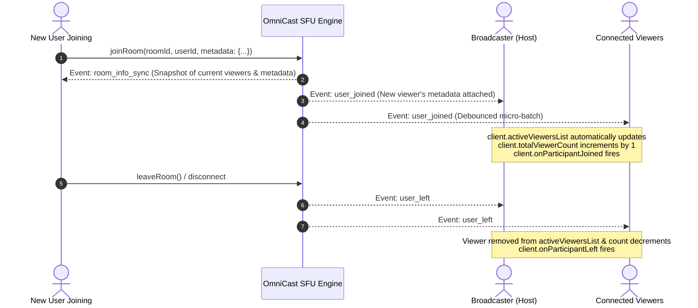

# 👥 OmniCast SDK: Viewers & Metadata Integration Guide

Comprehensive guide on accessing, tracking, and rendering **Real-Time Viewers, Active Participants, and Custom User Metadata** (Level, VIP Status, Badges, Coins, Avatars) in the OmniCast Flutter SDK.

---

## 📑 Table of Contents
1. [Overview & State Access Points](#1-overview--state-access-points)
2. [Data Model: `OmniCastParticipant`](#2-data-model-omnicastparticipant)
3. [Passing Metadata When Joining a Room](#3-passing-metadata-when-joining-a-room)
4. [Real-Time Lifecycle & State Sync](#4-real-time-lifecycle--state-sync)
5. [The Easiest Way: 1-Line Pre-Built Viewers Bottom Sheet](#5-the-easiest-way-1-line-pre-built-viewers-bottom-sheet)
6. [Building Custom UI Elements](#6-building-custom-ui-elements)
   - [A. Horizontal Top-Bar Live Avatars Row](#a-horizontal-top-bar-live-avatars-row)
   - [B. Total Live Viewer Counter Badge](#b-total-live-viewer-counter-badge)
   - [C. Real-Time Join/Leave Toast Notifications (Streams)](#c-real-time-joinleave-toast-notifications-streams)
7. [Best Practices & Performance Tuning](#7-best-practices--performance-tuning)

---

## 1. Overview & State Access Points

The SDK continuously keeps the participant and viewer list synchronized in real time with the SFU server. Developers can access this data directly from the `client` object:

| Access Point | Type | Description |
| :--- | :--- | :--- |
| `client.activeViewersList` / `client.viewersNotifier` | `ValueNotifier<List<OmniCastParticipant>>` | **Recommended for UI.** Highly optimized reactive list with micro-batch debouncing (50ms) to eliminate frame drops. |
| `client.totalViewerCount` / `client.viewerCountNotifier` | `ValueNotifier<int>` | Total number of viewers currently in the room (can exceed in-memory list size). |
| `client.onParticipantJoined` / `client.onUserJoined` | `Stream<OmniCastParticipant>` | Stream emitting whenever a new participant joins the room. |
| `client.onParticipantLeft` / `client.onUserLeft` | `Stream<String>` | Stream emitting the `userId` of any user who leaves. |
| `client.state.viewers` | `List<Participant>` | Snapshot list of current viewers stored in global `RoomState`. |

---

## 2. Data Model: `OmniCastParticipant`

```dart
class OmniCastParticipant {
  final String userId;                 // Unique User Identifier
  final String? displayName;           // User nickname / display name
  final String? avatarUrl;             // Profile picture URL
  final UserRole role;                 // Role: UserRole.viewer, UserRole.host, UserRole.coHost
  final bool isAudioMuted;             // Audio track state
  final bool isVideoMuted;             // Video track state
  final DateTime joinedAt;             // Join timestamp
  final Map<String, dynamic> metadata; // Custom metadata payload (Levels, Badges, VIP, etc.)
}

/// Backward compatibility alias
typedef Participant = OmniCastParticipant;
```

---

## 3. Passing Metadata When Joining a Room

When a user joins a live room as a viewer or host, arbitrary JSON-compatible metadata can be attached via `client.room.joinRoom()` or `client.room.createRoom()`:

```dart
await client.room.joinRoom(
  roomId: 'room_7057',
  userId: 'user_8588',
  metadata: {
    'displayName': 'Alex Johnson',
    'avatar': 'https://api.dicebear.com/7.x/bottts/png?seed=user_8588',
    'level': 99,
    'is_vip': true,
    'badge': '👑 Diamond Supporter',
    'country': 'BD',
    'role_title': 'Moderator',
  },
);
```

---

## 4. Real-Time Lifecycle & State Sync



---

## 5. The Easiest Way: 1-Line Pre-Built Viewers Bottom Sheet

Instead of writing 300+ lines of custom dialog code, use the SDK's built-in **`OmniCastViewersBottomSheet`**:

```dart
// Open complete active viewers sheet in 1 single line of code!
OmniCastViewersBottomSheet.show(context, client: _client);
```

### 🌟 What `OmniCastViewersBottomSheet` handles automatically:
1. **Real-time auto updates:** When new users join or leave, the list updates live.
2. **Metadata rendering:** Displays avatars, display names, `Lv.99` badges, and golden VIP badges automatically.
3. **Host-only Kick Button:** Automatically detects if the current user is Host (`client.state.isHost`) and shows the red **Kick** button only to the host.
4. **Interactive Ejection Dialog:** Includes a built-in reason selection popup (e.g. *Violated community guidelines*, *Spamming*, etc.) and executes `client.kickUser()` on confirmation.

### Optional Customization:
```dart
OmniCastViewersBottomSheet.show(
  context,
  client: _client,
  title: 'Live Room Viewers',
  enableHostKick: true,
  onUserKicked: (participant, reason) {
    debugPrint('User ${participant.userId} was kicked for: $reason');
  },
);
```

---

## 6. Building Custom UI Elements

### A. Horizontal Top-Bar Live Avatars Row

Place this inside your live room top navigation overlay to display circular avatars of currently watching viewers:

```dart
Widget buildLiveViewerAvatarsRow(BuildContext context, OmniCastClient client) {
  return ValueListenableBuilder<List<OmniCastParticipant>>(
    valueListenable: client.activeViewersList,
    builder: (context, viewers, _) {
      if (viewers.isEmpty) return const SizedBox.shrink();

      return SizedBox(
        height: 36,
        child: ListView.builder(
          scrollDirection: Axis.horizontal,
          itemCount: viewers.length > 10 ? 10 : viewers.length, // Display top 10
          itemBuilder: (context, index) {
            final viewer = viewers[index];
            return Padding(
              padding: const EdgeInsets.only(right: 6.0),
              child: GestureDetector(
                onTap: () => OmniCastViewersBottomSheet.show(context, client: client),
                child: CircleAvatar(
                  radius: 16,
                  backgroundImage: NetworkImage(
                    viewer.avatarUrl ?? 'https://api.dicebear.com/7.x/bottts/png?seed=${viewer.userId}',
                  ),
                ),
              ),
            );
          },
        ),
      );
    },
  );
}
```

---

### B. Total Live Viewer Counter Badge

```dart
Widget buildLiveViewerCountBadge(BuildContext context, OmniCastClient client) {
  return GestureDetector(
    onTap: () => OmniCastViewersBottomSheet.show(context, client: client),
    child: ValueListenableBuilder<int>(
      valueListenable: client.totalViewerCount,
      builder: (context, count, _) {
        return Container(
          padding: const EdgeInsets.symmetric(horizontal: 10, vertical: 4),
          decoration: BoxDecoration(
            color: Colors.black.withOpacity(0.5),
            borderRadius: BorderRadius.circular(14),
            border: Border.all(color: Colors.white24),
          ),
          child: Row(
            mainAxisSize: MainAxisSize.min,
            children: [
              const Icon(Icons.remove_red_eye_rounded, color: Colors.white70, size: 14),
              const SizedBox(width: 4),
              Text(
                '$count',
                style: const TextStyle(
                  color: Colors.white,
                  fontSize: 12,
                  fontWeight: FontWeight.bold,
                ),
              ),
            ],
          ),
        );
      },
    ),
  );
}
```

---

### C. Real-Time Join/Leave Toast Notifications (Streams)

```dart
@override
void initState() {
  super.initState();

  // 1. Listen for new participants joining
  _client.onParticipantJoined.listen((participant) {
    final name = participant.displayName ?? participant.userId;
    final level = participant.metadata['level'] ?? 1;

    ScaffoldMessenger.of(context).showSnackBar(
      SnackBar(
        content: Text('👋 $name (Lv.$level) joined the room!'),
        duration: const Duration(seconds: 2),
        backgroundColor: const Color(0xFF1E293B),
      ),
    );
  });

  // 2. Listen for participants leaving
  _client.onParticipantLeft.listen((leftUserId) {
    debugPrint('User $leftUserId left the broadcast');
  });
}
```

---

## 7. Best Practices & Performance Tuning

1. **Micro-Batching Protection:** The SDK automatically buffers high-frequency user joins and leaves within a 50ms window. This guarantees steady 60 FPS even during sudden traffic spikes (e.g. 500 users joining simultaneously).
2. **In-Memory Capping:** To protect mobile RAM, the active viewers list in memory is capped at 200 items, while `totalViewerCount` continues tracking unlimited viewer numbers (10,000+).
3. **Null-Safety on Metadata:** Always access metadata keys safely using fallback operators:
   ```dart
   final level = viewer.metadata['level'] as int? ?? 1;
   final isVip = viewer.metadata['is_vip'] as bool? ?? false;
   ```
